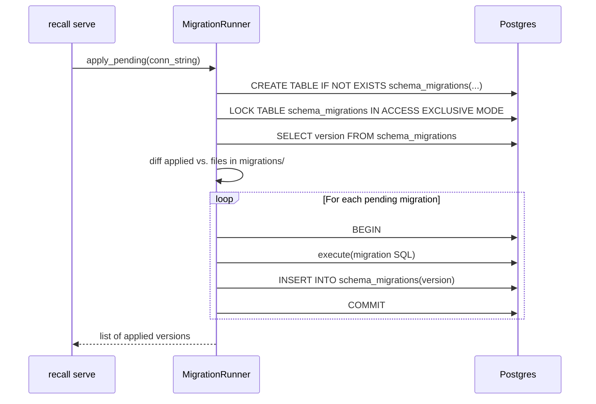
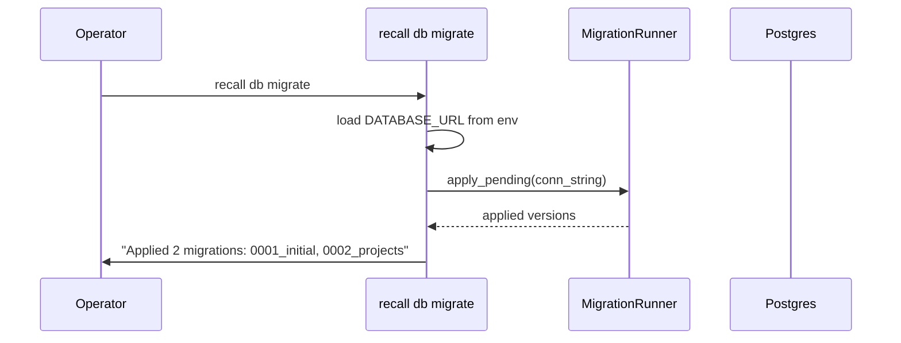
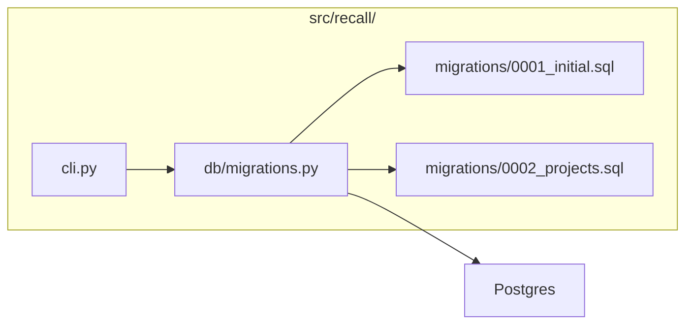

# LLD — E0.4: Migration Runner and Initial Schema

## Document Control

| Field | Value |
|-------|-------|
| Parent epic | E0.4 — Migration runner and initial schema |
| Issues | #40, #41, #42, #43 |
| HLD components | Migration Runner, CLI |
| ADRs | ADR-0001, ADR-0002, ADR-0009, ADR-0013 |
| Status | Draft |
| Date | 2026-04-12 |

---

## Part A — Human-Reviewable

### Purpose

Deliver the in-app DDL migration runner described in ADR-0013, the initial SQL
migration that creates the store tables (via `AsyncPostgresStore.setup()`) with
the scope CHECK constraint from ADR-0001/ADR-0002, the `recall db migrate` CLI
command, and the auto-migrate-on-startup hook for `recall serve`.

### Behavioural Flow — Migration on Startup



### Behavioural Flow — `recall db migrate`



### Structural Overview



### Invariants

| # | Invariant | Verification |
|---|-----------|-------------|
| I1 | Running `apply_pending` twice is idempotent — second run applies nothing | Integration test: call twice, assert second returns empty list |
| I2 | Concurrent `apply_pending` calls do not interleave — table lock serialises them | Integration test: two concurrent calls, both succeed, migrations applied exactly once |
| I3 | A failing migration rolls back its own transaction — no partial application | Integration test: migration with deliberate error, assert schema_migrations unchanged |
| I4 | `scope=global` requires `project_id='_'`; `scope=project` requires `project_id != '_'` | Integration test: INSERT violating CHECK raises |
| I5 | `lower(id) = 'global'` rejected in projects table | Integration test: INSERT 'Global' into projects raises |
| I6 | `0001_initial.sql` calls `AsyncPostgresStore.setup()` — store tables exist after migration | Integration test: after apply_pending, store.aput succeeds |

### Acceptance Criteria + BDD Specs

```python
class TestApplyPending:
    """Integration tests for the migration runner."""

    async def test_applies_all_pending_migrations(self, pg_conn: str) -> None:
        """Given an empty DB, apply_pending runs all migrations in order."""

    async def test_idempotent_second_run(self, pg_conn: str) -> None:
        """Given a fully migrated DB, apply_pending returns an empty list."""

    async def test_partial_failure_rolls_back(self, pg_conn: str) -> None:
        """Given a migration that raises, schema_migrations has no entry for it."""

    async def test_concurrent_calls_serialise(self, pg_conn: str) -> None:
        """Given two concurrent apply_pending calls, migrations apply exactly once."""


class TestInitialMigration:
    """Integration tests for 0001_initial.sql."""

    async def test_store_tables_created(self, migrated_db: str) -> None:
        """After 0001, the store and store_vectors tables exist."""

    async def test_scope_check_global_requires_underscore(self, migrated_db: str) -> None:
        """INSERT with scope='global', project_id='myproj' violates CHECK."""

    async def test_scope_check_project_rejects_underscore(self, migrated_db: str) -> None:
        """INSERT with scope='project', project_id='_' violates CHECK."""

    async def test_scope_check_happy_path(self, migrated_db: str) -> None:
        """INSERT with scope='project', project_id='myproj' succeeds."""


class TestProjectsMigration:
    """Integration tests for 0002_projects.sql."""

    async def test_projects_table_created(self, migrated_db: str) -> None:
        """After 0002, the projects table exists with expected columns."""

    async def test_global_name_rejected(self, migrated_db: str) -> None:
        """INSERT with id='Global' (any case) violates CHECK."""

    async def test_valid_project_accepted(self, migrated_db: str) -> None:
        """INSERT with id='my-project' succeeds."""
```

---

## Part B — Agent-Implementable

### HLD Coverage

- **Migration Runner** component — fully covered by this LLD.
- **CLI** component (`recall db migrate`) — the migration subcommand is covered here; `recall serve` startup hook is covered here; other CLI commands are out of scope.

### Layer: DB

#### `src/recall/migrations/0001_initial.sql`

Calls `AsyncPostgresStore.setup()` to create the `store`, `store_vectors`,
`store_migrations`, and `vector_migrations` tables. Then adds the scope CHECK
constraint on the `store` table.

```sql
-- 0001_initial.sql
-- Bootstrap the LangGraph store tables and add scope invariant.
--
-- NOTE: AsyncPostgresStore.setup() is called from Python before this file
-- executes, because setup() is not pure SQL — it's a Python method.
-- This migration file adds only the CHECK constraint that setup() doesn't know about.

-- Scope invariant (ADR-0001, ADR-0002):
--   scope='global'  → project_id must be '_'
--   scope='project' → project_id must not be '_'
--
-- The namespace is stored in the `prefix` column as '<scope>.<project_id>'.
-- We enforce the invariant via a CHECK on prefix patterns.
ALTER TABLE store ADD CONSTRAINT store_scope_invariant CHECK (
    (prefix LIKE 'global._' || '.%' OR prefix = 'global._')
    OR
    (prefix LIKE 'project.%' AND prefix NOT LIKE 'project._.%' AND prefix != 'project._')
);
```

**Design note:** The `prefix` column encodes `(scope, project_id)` as a
dot-separated string. The CHECK operates on this encoded form. The exact
encoding is determined by LangGraph's `_namespace_to_text`. We validate this
encoding in integration tests — if LangGraph changes the separator, the CHECK
will catch mismatches on first write.

**Revised approach:** Since `AsyncPostgresStore.setup()` is a Python async
method (not pure SQL), the migration runner must handle `0001_initial` as a
special case. The cleanest approach: `apply_pending` calls `store.setup()`
**before** processing SQL files, ensuring the store tables exist for any
SQL migration to reference. The `0001_initial.sql` file then contains only
the CHECK constraint ALTER. This keeps the "one migration path" invariant
from ADR-0013 — `setup()` is called exactly once, from within `apply_pending`.

#### `src/recall/migrations/0002_projects.sql`

```sql
-- 0002_projects.sql
-- Project registry table (ADR-0009).

CREATE TABLE IF NOT EXISTS projects (
    id           text PRIMARY KEY,
    display_name text NOT NULL,
    created_at   timestamptz NOT NULL DEFAULT now(),
    created_by   text NOT NULL,
    CONSTRAINT projects_no_global CHECK (lower(id) != 'global')
);
```

### Layer: BE

#### `src/recall/db/__init__.py`

Empty. Package marker.

#### `src/recall/db/migrations.py`

```python
"""In-app DDL migration runner (ADR-0013)."""

from pathlib import Path

MIGRATIONS_DIR = Path(__file__).resolve().parent.parent / "migrations"


async def apply_pending(conn_string: str) -> list[str]:
    """Apply all pending SQL migrations.

    1. Open a connection to Postgres.
    2. Create AsyncPostgresStore and call setup() — ensures store tables exist.
    3. Create schema_migrations table if not exists.
    4. Lock schema_migrations (ACCESS EXCLUSIVE).
    5. Read applied versions.
    6. Walk MIGRATIONS_DIR, apply pending files in filename order.
    7. Return list of newly applied version strings.

    Each migration runs in its own transaction. On failure the transaction
    rolls back and the function raises — no partial state.
    """
    ...
```

**Internal types:**

```python
# No custom types needed — versions are plain strings (e.g. "0001_initial").
# The function signature is the contract.
```

**Key implementation details:**

- Connection: use raw `asyncpg` (not the store) for migration DDL. The store
  is created with `AsyncPostgresStore.from_conn_string()` solely to call
  `setup()`, then closed.
- Locking: `LOCK TABLE schema_migrations IN ACCESS EXCLUSIVE MODE` inside a
  transaction. This serialises concurrent runners.
- File discovery: `sorted(MIGRATIONS_DIR.glob("*.sql"))`. Version is the
  filename stem (e.g. `0001_initial`).
- Per-file execution: `conn.execute(sql_text)` inside its own transaction.
  On success, `INSERT INTO schema_migrations(version)`. On exception,
  transaction rolls back, exception re-raised.

#### `src/recall/cli.py`

```python
"""Recall CLI entrypoint."""

import asyncio
import sys


def main() -> None:
    """Main CLI dispatcher.

    Subcommands:
        serve     — start the MCP server (stub in Phase 0)
        db migrate — run pending migrations
    """
    ...
```

**`db migrate` subcommand:**

- Reads `DATABASE_URL` from environment (required).
- Calls `apply_pending(conn_string)`.
- Prints applied migrations to stdout.
- Exits 0 on success, 1 on failure.

**`serve` startup hook:**

- Before starting the MCP server, checks `RECALL_DB_MIGRATE_ON_STARTUP`
  (default: `"true"`).
- If truthy, calls `apply_pending(conn_string)`.
- If migration fails, the server does not start (fail-fast).

### Internal Decomposition

The migration runner is deliberately simple (~50 lines per ADR-0013). No
internal decomposition beyond the single `apply_pending` function. The CLI
is a thin dispatcher using `argparse` or `sys.argv` parsing.

### Tasks

| # | Issue | Summary | Files touched |
|---|-------|---------|---------------|
| 1 | #40 | `apply_pending` function | `src/recall/db/__init__.py`, `src/recall/db/migrations.py` |
| 2 | #41 | `0001_initial.sql` + `0002_projects.sql` | `src/recall/migrations/0001_initial.sql`, `src/recall/migrations/0002_projects.sql` |
| 3 | #42 | `recall db migrate` CLI + serve startup hook | `src/recall/cli.py` |
| 4 | #43 | Migration runner unit + integration tests | `tests/test_migrations.py` |
