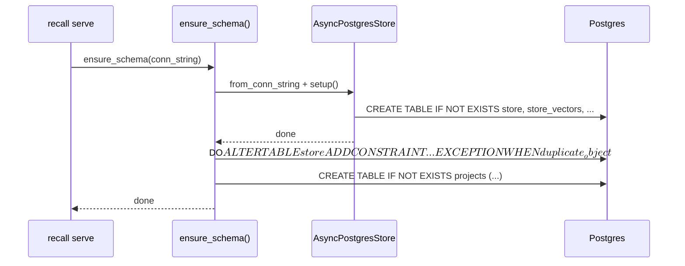
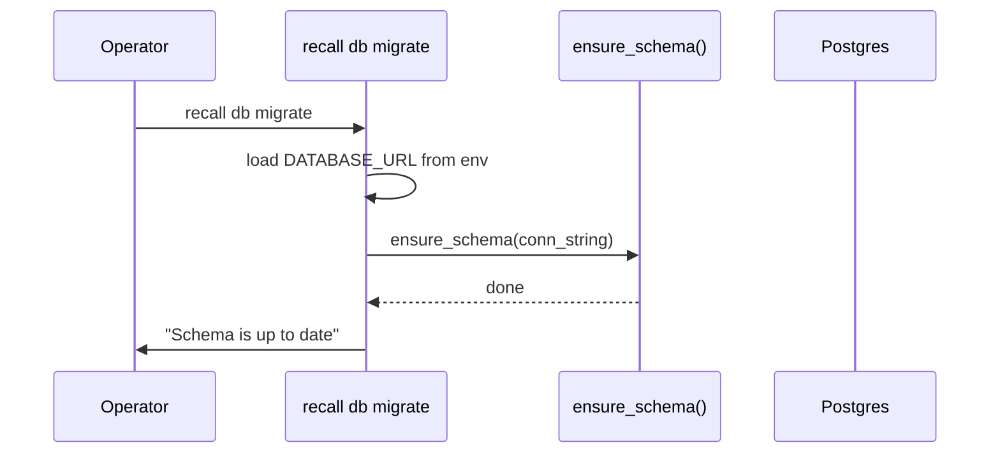
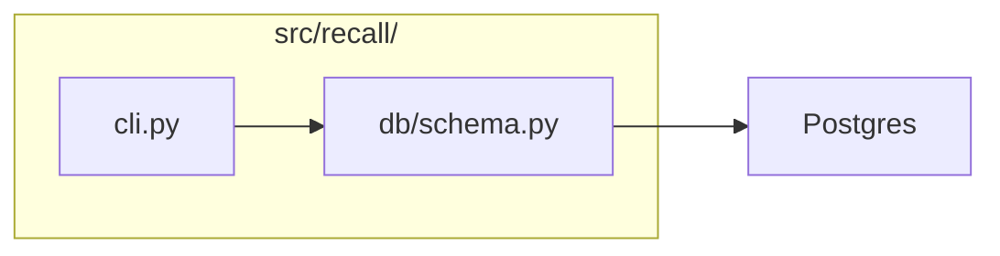

# LLD — E0.4: Schema Setup (ensure_schema)

## Document Control

| Field | Value |
|-------|-------|
| Parent epic | #72 — E0: Phase 0: Foundation |
| Task issue | #76 — E0.4: Migration runner and initial schema |
| HLD components | Migration Runner, CLI |
| ADRs | ADR-0001, ADR-0002, ADR-0009, ADR-0013 (revised) |
| Status | Draft |
| Date | 2026-04-22 (rewrite of 2026-04-12 original) |

---

## Part A — Human-Reviewable

### Purpose

Deliver the idempotent `ensure_schema()` function described in the revised
ADR-0013, the `recall db migrate` CLI command, and the auto-migrate-on-startup
hook for `recall serve`. Replaces the original migration-runner design with a
simpler approach: call `AsyncPostgresStore.setup()` then execute two idempotent
DDL statements inline.

### Behavioural Flow — Schema Setup on Startup



### Behavioural Flow — `recall db migrate`



### Structural Overview



### Invariants

| # | Invariant | Verification |
|---|-----------|-------------|
| I1 | Running `ensure_schema` twice is idempotent — second run changes nothing | Integration test: call twice, second succeeds without error |
| I2 | `scope=global` requires `project_id='_'`; `scope=project` requires `project_id != '_'` | Integration test: INSERT violating CHECK raises |
| I3 | `lower(id) = 'global'` rejected in projects table | Integration test: INSERT 'Global' into projects raises |
| I4 | After `ensure_schema`, `AsyncPostgresStore.aput` succeeds | Integration test: aput after ensure_schema works |

### Acceptance Criteria + BDD Specs

```python
class TestEnsureSchema:
    """Integration tests for ensure_schema."""

    async def test_creates_all_tables(self, pg_conn: str) -> None:
        """Given an empty DB, ensure_schema creates store, store_vectors, projects."""

    async def test_idempotent_second_run(self, pg_conn: str) -> None:
        """Given a fully set-up DB, ensure_schema succeeds with no errors."""

    async def test_store_usable_after_setup(self, pg_conn: str) -> None:
        """After ensure_schema, AsyncPostgresStore.aput succeeds."""


class TestScopeConstraint:
    """Integration tests for the scope CHECK constraint."""

    async def test_global_requires_underscore(self, migrated_db: str) -> None:
        """INSERT with prefix='global.myproj' violates CHECK."""

    async def test_project_rejects_underscore(self, migrated_db: str) -> None:
        """INSERT with prefix='project._' violates CHECK."""

    async def test_happy_path_project(self, migrated_db: str) -> None:
        """INSERT with prefix='project.myproj' succeeds."""

    async def test_happy_path_global(self, migrated_db: str) -> None:
        """INSERT with prefix='global._' succeeds."""


class TestProjectsTable:
    """Integration tests for the projects table."""

    async def test_projects_table_created(self, migrated_db: str) -> None:
        """After ensure_schema, the projects table exists with expected columns."""

    async def test_global_name_rejected(self, migrated_db: str) -> None:
        """INSERT with id='Global' (any case) violates CHECK."""

    async def test_valid_project_accepted(self, migrated_db: str) -> None:
        """INSERT with id='my-project' succeeds."""


class TestCliDbMigrate:
    """CLI-level tests for `recall db migrate`."""

    async def test_exits_zero_on_success(self, pg_conn: str) -> None:
        """`recall db migrate` with DATABASE_URL exits 0."""

    def test_exits_one_without_database_url(self) -> None:
        """Without DATABASE_URL, exits 1 with clean error."""


class TestCliServeStartup:
    """`recall serve` auto-migrate hook."""

    async def test_default_runs_schema_setup(self, pg_conn: str) -> None:
        """Default (flag unset) → schema is set up on startup."""

    async def test_false_skips_schema_setup(self, pg_conn: str) -> None:
        """RECALL_DB_MIGRATE_ON_STARTUP=false → schema NOT set up."""
```

---

## Part B — Agent-Implementable

### HLD Coverage

- **Migration Runner** component — fully covered by this LLD (as `ensure_schema`).
- **CLI** component (`recall db migrate`) — the migration subcommand is covered here; `recall serve` startup hook is covered here.

### Layer: BE

#### `src/recall/db/__init__.py`

Empty. Package marker.

#### `src/recall/db/schema.py`

```python
"""Idempotent schema setup (revised ADR-0013)."""

from __future__ import annotations

import os
from collections.abc import Sequence

import psycopg
from langgraph.store.postgres import AsyncPostgresStore
from langgraph.store.postgres.base import PostgresIndexConfig

_DEFAULT_DIMS = 1536

_SCOPE_CHECK_SQL = """\
DO $$ BEGIN
    ALTER TABLE store ADD CONSTRAINT store_scope_invariant CHECK (
        prefix = 'global._'
        OR (prefix LIKE 'project.%' AND prefix != 'project._')
    );
EXCEPTION WHEN duplicate_object THEN NULL;
END $$;
"""

_PROJECTS_TABLE_SQL = """\
CREATE TABLE IF NOT EXISTS projects (
    id           text PRIMARY KEY,
    display_name text NOT NULL,
    created_at   timestamptz NOT NULL DEFAULT now(),
    created_by   text NOT NULL,
    CONSTRAINT projects_no_global CHECK (lower(id) != 'global')
);
"""


def _phase0_index_config() -> PostgresIndexConfig:
    """Return a minimal PostgresIndexConfig sufficient for setup() DDL."""

    def _noop_embed(texts: Sequence[str]) -> list[list[float]]:
        raise RuntimeError("Phase-0 placeholder; wire a real provider.")

    raw_dims = os.environ.get("RECALL_EMBEDDING_DIMS")
    dims = int(raw_dims) if raw_dims else _DEFAULT_DIMS
    return PostgresIndexConfig(dims=dims, embed=_noop_embed)


async def ensure_schema(conn_string: str) -> None:
    """Create all required tables and constraints. Idempotent.

    1. AsyncPostgresStore.setup() — store + store_vectors.
    2. Scope CHECK constraint on store table.
    3. Projects table.
    """
    async with AsyncPostgresStore.from_conn_string(
        conn_string, index=_phase0_index_config()
    ) as store:
        await store.setup()

    async with await psycopg.AsyncConnection.connect(
        conn_string, autocommit=True
    ) as conn:
        await conn.execute(_SCOPE_CHECK_SQL)
        await conn.execute(_PROJECTS_TABLE_SQL)
```

#### `src/recall/cli.py`

Update `_cmd_serve` and `_cmd_db_migrate` to call `ensure_schema` instead of
`apply_pending`. Same env-var contract (`DATABASE_URL`,
`RECALL_DB_MIGRATE_ON_STARTUP`). Same exit codes.

### Layer: Test

#### `tests/conftest.py`

Keep the session-scoped pgvector container and `pg_conn` / `migrated_db`
fixtures from the existing PR. Change `migrated_db` to call `ensure_schema`
instead of `apply_pending`. Drop the `schema_migrations` table from the
cleanup list (it no longer exists).

#### `tests/test_schema.py`

Integration tests per the BDD specs above. Simpler than `test_migrations.py`:
no concurrency tests, no partial-rollback tests, no migration-ordering tests.
Focus on schema correctness (tables exist, constraints enforce invariants,
store is usable).

### Files

- `src/recall/db/__init__.py` — package marker
- `src/recall/db/schema.py` — `ensure_schema` function
- `src/recall/cli.py` — updated `db migrate` + serve startup
- `tests/conftest.py` — test fixtures
- `tests/test_schema.py` — integration tests
- `tests/test_cli.py` — updated CLI tests

### Deleted files (from PR #82, if any were merged)

- `src/recall/db/migrations.py` — replaced by `schema.py`
- `src/recall/migrations/` — entire directory, no longer needed
- `tests/test_migrations.py` — replaced by `test_schema.py`
- `tests/evaluation/test_e04_migration_runner_eval.py` — no longer applicable
