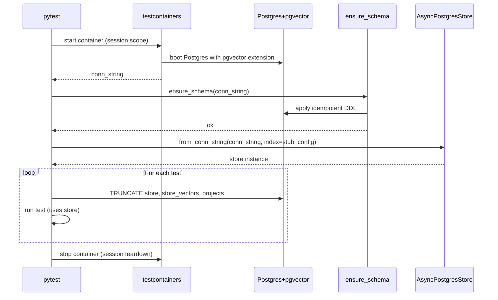
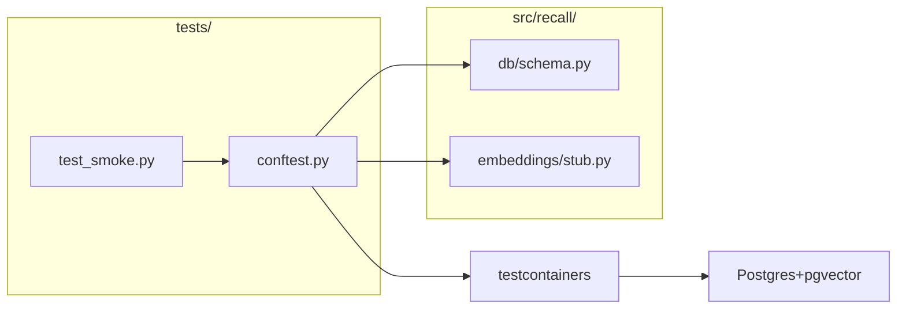

# LLD — E0.5: Real-Postgres Test Fixture

## Document Control

| Field | Value |
|-------|-------|
| Parent epic | #72 — E0: Phase 0: Foundation |
| Task issue | #77 — E0.5: Real-Postgres test fixture |
| HLD components | Cross-cutting test infrastructure |
| ADRs | ADR-0008, ADR-0012, ADR-0013 |
| Version | 0.2 |
| Status | Revised |
| Date | 2026-04-12 |
| Revised | 2026-08-06 | Issue #77 |

---

## Part A — Human-Reviewable

### Purpose

Deliver the real-Postgres integration test infrastructure mandated by ADR-0012:
a session-scoped testcontainers fixture, a per-test isolation strategy, a
deterministic stub embeddings provider, and a smoke test proving the whole
stack works. Every later phase's integration tests build on these fixtures.

### Behavioural Flow — Test Session Lifecycle



### Structural Overview



### Invariants

| # | Invariant | Verification |
|---|-----------|-------------|
| I1 | One container per session — not per test | Fixture is `session`-scoped; TRUNCATE provides isolation |
| I2 | Migrations run exactly once per session | `ensure_schema` called in session fixture, not per-test |
| I3 | Tests are isolated — data from test A does not leak to test B | TRUNCATE before each test; integration test: two tests inserting same key both succeed |
| I4 | Stub embeddings are deterministic — same input produces same vector | Unit test: `embed(["hello"])` called twice returns identical vectors |
| I5 | Stub embeddings produce vectors of the configured dimension | Unit test: `len(embed(["hello"])[0]) == dim` |
| I6 | The smoke test proves: container boots, schema applies, a row inserts and reads back | Integration test: the smoke test itself |

### Per-Test Isolation Strategy Decision

ADR-0012 defers the choice between transactional rollback and per-test schemas
to this LLD. We choose **TRUNCATE**:

- **Transactional rollback** requires wrapping each test in a single
  transaction and rolling back at the end. This breaks with `asyncpg`
  connection pools where the store may open separate connections, and with
  DDL operations that force implicit commits.
- **Per-test schemas** (`CREATE SCHEMA test_N; ... DROP SCHEMA`) are clean
  but slow and require reconfiguring the store's search path per test.
- **TRUNCATE** of the `store` and `store_vectors` tables between tests is
  simple, correct, and fast for the test volumes Phase 0 will have. It runs in
  a fraction of a millisecond on empty-ish tables. The `projects` table named
  in earlier drafts does not exist yet — it is deferred per ADR-0014, so only
  `store` and `store_vectors` are truncated.

If test count grows to the point where TRUNCATE overhead matters, we revisit.

### Deterministic Stub Embeddings Provider

The stub provider generates reproducible vectors from input text using a
hash-based approach. It implements the same `EmbeddingsProvider` interface
that real providers will implement (ADR-0008), so tests exercise the real
embedding integration path.

The stub lives in `src/recall/embeddings/stub.py` (not in `tests/`) because:
1. The `apply_pending` + `setup()` path needs an index config with an
   embeddings provider to create the `store_vectors` table with correct dims.
2. The stub may be useful for local development without an API key.

### Acceptance Criteria + BDD Specs

```python
class TestStubEmbeddingsProvider:
    """Unit tests for the deterministic stub provider."""

    def test_deterministic_output(self) -> None:
        """Given the same input, embed() returns identical vectors."""

    def test_correct_dimension(self) -> None:
        """Given dim=384, each vector has exactly 384 elements."""

    def test_different_inputs_different_vectors(self) -> None:
        """Given different input texts, vectors are not identical."""

    def test_batch_input(self) -> None:
        """Given a list of N texts, returns N vectors."""

    def test_normalised_vectors(self) -> None:
        """Each vector has unit L2 norm (for cosine similarity)."""


@pytest.mark.integration
class TestTestFixture:
    """Integration tests proving the fixture itself works."""

    async def test_container_boots_and_schema_applies(
        self, pg_conn_string: str
    ) -> None:
        """The session fixture delivers a conn_string to a running Postgres
        with all migrations applied."""

    async def test_truncate_isolation(
        self, store: AsyncPostgresStore
    ) -> None:
        """Data inserted in one test is not visible in the next. The sibling
        test asserts the table is empty at test start."""

    async def test_truncate_isolation_no_leak(
        self, store: AsyncPostgresStore
    ) -> None:
        """The table is empty at test start because the previous test's data
        was truncated."""


@pytest.mark.integration
class TestSmoke:
    """Smoke integration test — the Phase 0 exit criterion."""

    async def test_insert_and_read_back(
        self, store: AsyncPostgresStore
    ) -> None:
        """Given an empty DB, aput a record then aget it back.
        Assert the value round-trips."""

    async def test_scope_check_enforced(
        self, store: AsyncPostgresStore
    ) -> None:
        """Given a record with scope=global and project_id!='_',
        aput raises (CHECK constraint)."""
```

> **Implementation note (issue #77):** The test-author expanded the stub unit
> suite beyond the five BDD specs above — custom-dimension vectors, empty-input
> handling, and the public `dim` attribute are all covered in
> `tests/test_stub_embeddings.py` (13 tests).

---

## Part B — Agent-Implementable

### HLD Coverage

- **Cross-cutting test infrastructure** — fully covered by this LLD.
- **Embedder** component — the stub provider interface is defined here; real
  providers are Phase 1 (E1.3).

### Layer: BE

#### `src/recall/embeddings/__init__.py`

Empty. Package marker.

#### `src/recall/embeddings/stub.py`

```python
"""Deterministic stub embeddings provider for tests and local dev."""

from __future__ import annotations

import hashlib
import struct


class StubEmbeddingsProvider:
    """Produces deterministic vectors from input text via hashing.

    Implements the EmbeddingsProvider interface (ADR-0008):
        dim: int
        embed(texts: list[str]) -> list[list[float]]
    """

    def __init__(self, dim: int = 384) -> None:
        self.dim = dim

    def embed(self, texts: list[str]) -> list[list[float]]:
        """Return one vector per input text. Deterministic and normalised."""
        ...
```

**Implementation approach:**

1. For each text, compute `hashlib.sha256(text.encode()).digest()`.
2. Extend the hash bytes by rehashing to fill `dim` floats:
   `bytes_needed = dim * 4`; chain `sha256(digest + counter)` until enough.
3. Unpack the bytes as `dim` unsigned 32-bit ints
   (`struct.unpack(f'{dim}I', raw_bytes[:dim*4])`) and map each to `[-1, 1)`
   via `(i / 0xFFFFFFFF) * 2.0 - 1.0`.
4. L2-normalise the resulting vector so cosine similarity is meaningful.

This ensures: deterministic, different inputs → different vectors, correct
dimension, unit norm.

> **Implementation note (issue #77):** The draft proposed unpacking the hash
> bytes directly as IEEE-754 floats (`struct.unpack(f'{dim}f', ...)`). Raw
> hash bytes frequently form NaN/inf bit patterns, which corrupt normalisation.
> The implementation instead reinterprets the bytes as unsigned ints and maps
> them into `[-1, 1)`, which is always finite.

#### `tests/conftest.py`

```python
"""Shared pytest fixtures for the Recall test suite."""

import psycopg
import pytest
import pytest_asyncio

# Session-scoped fixtures (one container per test run)

@pytest.fixture(scope="session")
def postgres_container():
    """Start a Postgres+pgvector container for the session.

    Uses testcontainers PostgresContainer with the pgvector image
    (pgvector/pgvector:pg16). Yields the container, stops on teardown.
    """
    ...

@pytest.fixture(scope="session")
def postgres_dsn(postgres_container) -> str:
    """Connection string, normalised from the testcontainers default
    ``postgresql+psycopg2://`` scheme to bare ``postgresql://``."""
    ...

@pytest.fixture(scope="session")
def pg_conn_string(postgres_dsn) -> str:
    """Alias for the session's Postgres connection string."""
    ...

@pytest_asyncio.fixture(scope="session")
async def _migrated_db_sess(pg_conn_string: str) -> None:
    """Run ensure_schema once for the session (ADR-0013)."""
    ...

@pytest_asyncio.fixture(scope="session")
async def _store_session(pg_conn_string: str, _migrated_db_sess: None):
    """Session-scoped marker — _migrated_db_sess ensures schema is ready."""
    ...

# Per-test fixtures (isolation via TRUNCATE)

@pytest_asyncio.fixture
async def store(_store_session, pg_conn_string: str):
    """Per-test store fixture. TRUNCATEs store, store_vectors before
    yielding an AsyncPostgresStore backed by the StubEmbeddingsProvider.

    This ensures each test starts with a clean state.
    """
    ...
```

**Key implementation details:**

- **Container image:** `pgvector/pgvector:pg16` — includes both Postgres 16
  and the pgvector extension pre-installed.
- **Schema setup:** `ensure_schema()` from `recall.db.schema` (ADR-0013)
  applies the recall-owned DDL idempotently, once per session. The
  `AsyncPostgresStore.setup()` handles LangGraph-managed tables.
- **TRUNCATE:** Before each test, execute
  `TRUNCATE store, store_vectors CASCADE` via a raw `psycopg.AsyncConnection`.
  This is faster than DROP/CREATE and preserves the schema. The `projects`
  table is deferred per ADR-0014.
- **Store index config:** Use `PostgresIndexConfig(dims=stub.dim, embed=_embed)`
  where `_embed` delegates to the `StubEmbeddingsProvider` — the store's native
  `embed` callable, no LangChain adapter needed. `dims` matches the stub's
  `dim` (384).
- **Event loop:** On Windows, `asyncio.WindowsSelectorEventLoopPolicy()` must
  be installed for `psycopg` async connections. `pytest-asyncio` handles the
  loop; session-scoped async fixtures use `scope="session"`.

> **Implementation note (issue #77):** The draft referenced `apply_pending`
> (the pre-ADR-0013 migration runner) and raw asyncpg connections. By the time
> this landed, ADR-0013 had replaced the migration runner with the idempotent
> `ensure_schema()` setup, and raw DB access (TRUNCATE, schema checks) uses
> `psycopg.AsyncConnection`. Fixture names in the draft (`pg_container`,
> `_migrated_db`) were renamed (`postgres_container`, `_migrated_db_sess`).

#### `tests/test_smoke.py`

```python
"""Smoke integration test — Phase 0 exit criterion."""

import pytest

pytestmark = pytest.mark.integration


class TestSmoke:
    async def test_insert_and_read_back(self, store) -> None:
        """aput then aget round-trips a memory record."""
        ...

    async def test_scope_check_enforced(self, store) -> None:
        """The scope CHECK constraint rejects invalid combinations."""
        ...
```

### Files

Implemented as a single task (#77):

- `tests/conftest.py` — session-scoped container, per-test TRUNCATE, apply_pending
- `src/recall/embeddings/__init__.py` — package marker
- `src/recall/embeddings/stub.py` — deterministic stub embeddings provider
- `tests/test_stub_embeddings.py` — unit tests for stub provider
- `tests/test_smoke.py` — smoke integration test
