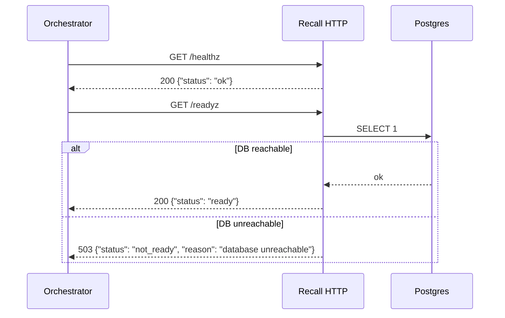
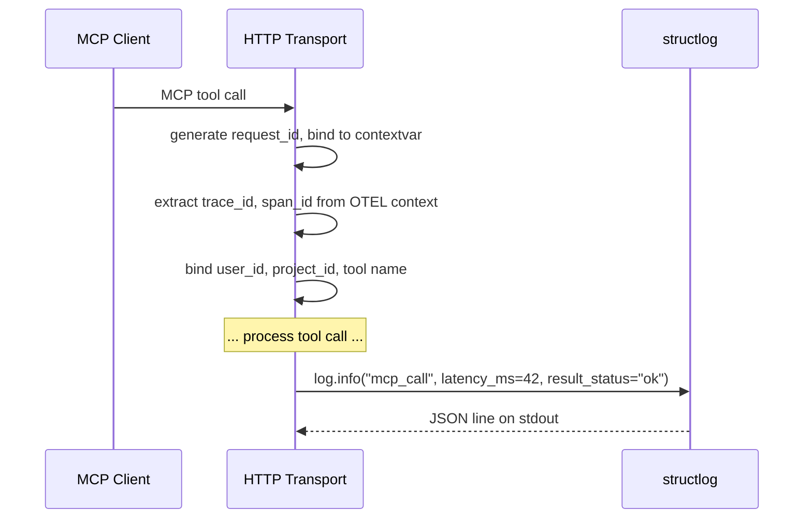
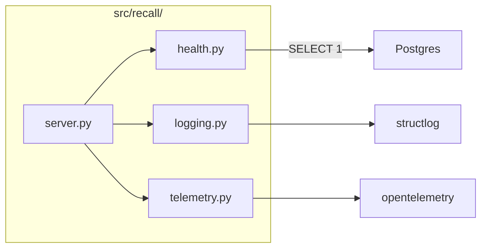

# LLD — E0.6: Health Endpoints and Structured Logging Skeleton

## Document Control

| Field | Value |
|-------|-------|
| Parent epic | E0.6 — Health endpoints and structured logging skeleton |
| Issues | #49, #50, #51, #52, #53 |
| HLD components | Health Endpoints, Tool Router (logging), MCP Transport |
| ADRs | ADR-0006, ADR-0011 |
| Status | Draft |
| Date | 2026-04-12 |

---

## Part A — Human-Reviewable

### Purpose

Deliver the `/healthz` and `/readyz` HTTP endpoints on the same Streamable HTTP
listener (ADR-0006), the `structlog` configuration with contextvars for
request-scoped fields (ADR-0011), library logging bridged into structlog, and
OTEL initialised in no-op mode by default. This is the observability skeleton
that every later phase builds on.

### Behavioural Flow — Health Check



### Behavioural Flow — Structured Logging on MCP Call



### Structural Overview



### Invariants

| # | Invariant | Verification |
|---|-----------|-------------|
| I1 | `/healthz` always returns 200 if the process is alive | Integration test: GET /healthz returns 200 |
| I2 | `/readyz` returns 200 when DB is reachable, 503 when not | Integration test: with DB up → 200; with bad conn → 503 |
| I3 | All log output is JSON on stdout via structlog — no `print()`, no stdlib `logging.info()` | Grep test in CI: no bare `print(` or `logging.getLogger` in `src/` |
| I4 | Every log line includes `request_id`, `trace_id`, `span_id` when in a request context | Integration test: capture log output, assert fields present |
| I5 | `trace_id`/`span_id` are present even when OTEL exporter is off (no-op mode) | Integration test: no OTEL endpoint set, log still has trace fields |
| I6 | Library logging (asyncpg, httpx, mcp) routes through structlog | Unit test: trigger a library log event, capture output, assert JSON format |
| I7 | Health endpoints respond within 1 second | Integration test: assert response time < 1s |

### Acceptance Criteria + BDD Specs

```python
@pytest.mark.integration
class TestHealthEndpoints:
    """Integration tests for /healthz and /readyz."""

    async def test_healthz_returns_ok(self, http_client) -> None:
        """GET /healthz returns 200 with status 'ok'."""

    async def test_readyz_returns_ready_when_db_up(self, http_client) -> None:
        """GET /readyz returns 200 with status 'ready' when DB is reachable."""

    async def test_readyz_returns_503_when_db_down(
        self, http_client_bad_db
    ) -> None:
        """GET /readyz returns 503 when DB connection fails."""


class TestStructlogConfiguration:
    """Unit tests for the logging setup."""

    def test_json_output_format(self, capfd) -> None:
        """A log event produces a single JSON line on stdout."""

    def test_contextvar_fields_bound(self, capfd) -> None:
        """Fields bound via contextvar appear in the log output."""

    def test_library_logging_bridged(self, capfd) -> None:
        """A stdlib logging.warning() call from a library is captured
        as a structlog JSON event."""


class TestOtelSetup:
    """Unit tests for OTEL initialisation."""

    def test_noop_mode_when_no_endpoint(self) -> None:
        """When OTEL_EXPORTER_OTLP_ENDPOINT is unset, OTEL initialises
        in no-op mode with no errors."""

    def test_trace_context_available_in_noop_mode(self) -> None:
        """trace_id and span_id are extractable even in no-op mode
        (they will be zero/invalid but present)."""


@pytest.mark.integration
class TestBootAndHealthSmoke:
    """The Phase 0 exit criterion integration test."""

    async def test_server_boots_health_returns_ok_log_emitted(
        self, running_server, captured_logs
    ) -> None:
        """Given a running server:
        1. GET /healthz returns 200
        2. At least one structured log line is emitted
        3. The log line has the expected field set (level, timestamp, event)
        """
```

---

## Part B — Agent-Implementable

### HLD Coverage

- **Health Endpoints** component — fully covered.
- **MCP Transport** component — the HTTP listener setup is covered here
  (enough to serve health endpoints); full MCP tool routing is Phase 1.
- **Tool Router (logging)** — the structlog configuration is covered here;
  the per-tool-call `mcp_call` event logging is Phase 1 (when tools exist).

### Layer: BE

#### `src/recall/server.py`

```python
"""Recall HTTP server — Streamable HTTP + health endpoints."""

from starlette.applications import Starlette
from starlette.routing import Route


def create_app(conn_string: str) -> Starlette:
    """Create the ASGI application.

    Mounts:
    - /healthz — liveness probe
    - /readyz  — readiness probe (DB check)
    - /mcp     — MCP Streamable HTTP endpoint (stub in Phase 0)

    Args:
        conn_string: Postgres connection string for readyz and store.

    Returns:
        Starlette ASGI application.
    """
    ...
```

**Design note:** The MCP Python SDK's Streamable HTTP server integrates with
Starlette/ASGI. We create a Starlette app and mount both health endpoints and
the MCP endpoint on it. In Phase 0 the MCP endpoint is a stub; health
endpoints are real. `uvicorn` serves the app.

#### `src/recall/health.py`

```python
"""Health check endpoints."""

from starlette.requests import Request
from starlette.responses import JSONResponse


async def healthz(request: Request) -> JSONResponse:
    """Liveness probe. Always returns 200 if the process is alive."""
    return JSONResponse({"status": "ok"})


async def readyz(request: Request) -> JSONResponse:
    """Readiness probe. Returns 200 if DB is reachable, 503 otherwise.

    Executes SELECT 1 against the connection pool stored in app.state.
    Times out after 2 seconds.
    """
    ...
```

**Implementation details:**

- The DB connection pool is stored on `request.app.state.pool` at startup.
- `readyz` acquires a connection from the pool, runs `SELECT 1`, releases.
- On `asyncpg.PostgresError` or timeout, returns 503 with a reason field.
- No heavy queries — must respond within 1 second.

#### `src/recall/logging.py`

```python
"""Structured logging configuration (ADR-0011)."""

import logging
import structlog


def configure_logging(log_level: str = "INFO") -> None:
    """Configure structlog as the sole logging path.

    1. Set up structlog processor chain:
       - add_log_level
       - ContextVarsProcessor (binds request_id, trace_id, span_id)
       - TimeStamper(fmt="iso", utc=True)
       - JSONRenderer
    2. Bridge stdlib logging into structlog via structlog.stdlib.ProcessorFormatter.
    3. Set root logger to use the bridge handler.

    After this call, all logging — structlog and stdlib — emits JSON on stdout.
    """
    ...


def bind_request_context(
    request_id: str,
    trace_id: str = "",
    span_id: str = "",
) -> None:
    """Bind request-scoped fields to the structlog contextvar.

    Called at the transport boundary when a request arrives.
    """
    ...


def unbind_request_context() -> None:
    """Clear request-scoped fields after a request completes."""
    ...
```

**Key implementation details:**

- **Processor chain:** `[ContextVarsProcessor, add_log_level, TimeStamper, JSONRenderer]`
- **stdlib bridge:** `structlog.stdlib.ProcessorFormatter` attached to a
  `logging.StreamHandler(sys.stdout)`. Set as the handler on the root logger.
  This captures asyncpg, httpx, mcp SDK, and any other library logging.
- **Log level:** Controlled by `LOG_LEVEL` env var. Defaults to `INFO`.
- **No module-level loggers:** All code uses `structlog.get_logger()`.

#### `src/recall/telemetry.py`

```python
"""OpenTelemetry initialisation (ADR-0011)."""


def configure_telemetry() -> None:
    """Initialise OTEL in no-op or export mode.

    If OTEL_EXPORTER_OTLP_ENDPOINT is set:
        - Configure OTLP exporter
        - Enable auto-instrumentation for HTTP, asyncpg, httpx
    Else:
        - Initialise with NoOpTracerProvider (effectively free)

    In both modes, trace_id and span_id are available in the OTEL
    context for structlog to extract.
    """
    ...


def get_trace_context() -> tuple[str, str]:
    """Extract current trace_id and span_id from OTEL context.

    Returns ("", "") if no active span.
    """
    ...
```

**Key implementation details:**

- **No-op mode:** `NoOpTracerProvider` from `opentelemetry.api`. Zero
  runtime cost. `get_trace_context()` returns empty strings.
- **Export mode:** `OTLPSpanExporter` + `BatchSpanProcessor`. Auto-instrument
  via `opentelemetry-instrumentation-*` packages (HTTP, asyncpg, httpx).
- **Phase 0 scope:** Only the no-op path needs to work. Export mode is wired
  but not exercised until Phase 4 (E4.2). The code exists to validate the
  initialisation path.

#### CLI integration (`src/recall/cli.py` update)

The `serve` subcommand (from E0.4) is updated to:

1. Call `configure_logging(log_level)` before anything else.
2. Call `configure_telemetry()`.
3. Optionally call `apply_pending()` (from E0.4).
4. Create the ASGI app via `create_app()`.
5. Run `uvicorn.run(app, host=host, port=port)`.

### Internal Decomposition

| Module | Responsibility | Boundary |
|--------|---------------|----------|
| `server.py` | ASGI app assembly, route mounting | Depends on health.py, delegates to MCP SDK |
| `health.py` | /healthz and /readyz handlers | Reads DB pool from app.state |
| `logging.py` | structlog + stdlib bridge config | Pure configuration, no I/O |
| `telemetry.py` | OTEL init (no-op or export) | Reads env vars, configures global tracer |

### Tasks

| # | Issue | Summary | Files touched |
|---|-------|---------|---------------|
| 1 | #49 | `/healthz` and `/readyz` on Starlette app | `src/recall/server.py`, `src/recall/health.py` |
| 2 | #50 | structlog config with contextvars | `src/recall/logging.py` |
| 3 | #51 | Bridge stdlib/library logging into structlog | `src/recall/logging.py` |
| 4 | #52 | OTEL no-op mode initialisation | `src/recall/telemetry.py` |
| 5 | #53 | Boot + health smoke integration test | `tests/test_health.py` |
