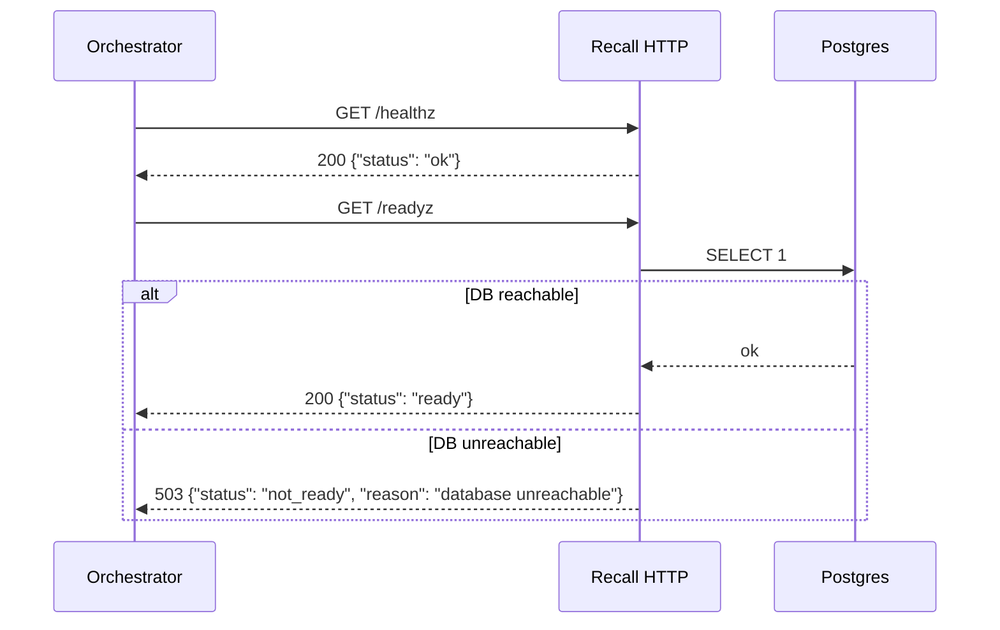
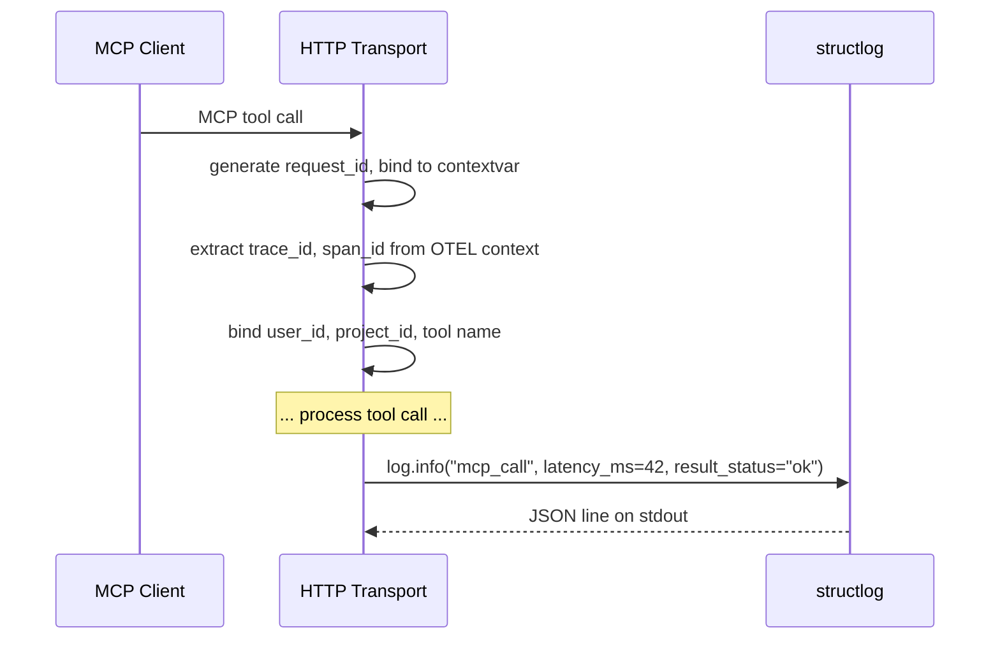
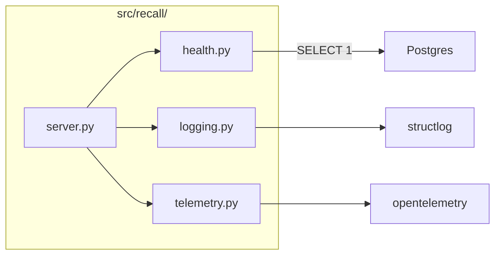

# LLD — E0.6: Health Endpoints and Structured Logging Skeleton

## Document Control

| Field | Value |
|-------|-------|
| Parent epic | #72 — E0: Phase 0: Foundation |
| Task issue | #78 — E0.6: Health endpoints and structured logging skeleton |
| HLD components | Health Endpoints, Tool Router (logging), MCP Transport |
| ADRs | ADR-0006, ADR-0011 |
| Status | Revised |
| Date | 2026-04-12 |
| Revised | 2026-04-22 | Issue #78 (post-implementation sync) |
| Version | 0.2 |

---

## Part A — Human-Reviewable

### Purpose

Deliver the `/healthz` and `/readyz` HTTP endpoints on the same Streamable HTTP
listener (ADR-0006), the `structlog` configuration with contextvars for
request-scoped fields (ADR-0011), library logging bridged into structlog, and
OTEL initialised in no-op mode by default. This is the observability skeleton
that every later phase builds on.

### Behavioural Flow — Health Check



### Behavioural Flow — Structured Logging on MCP Call



### Structural Overview



### Invariants

| # | Invariant | Verification |
|---|-----------|-------------|
| I1 | `/healthz` always returns 200 if the process is alive | Integration test: GET /healthz returns 200 |
| I2 | `/readyz` returns 200 when DB is reachable, 503 when not | Integration test: with DB up → 200; with bad conn → 503 |
| I3 | All log output is JSON on stdout via structlog — no `print()`, no stdlib `logging.info()` | Grep test in CI: no bare `print(` or `logging.getLogger` in `src/` |
| I4 | Every log line includes `request_id`, `trace_id`, `span_id` when in a request context | Integration test: capture log output, assert fields present |
| I5 | `trace_id`/`span_id` are present even when OTEL exporter is off (no-op mode) | Integration test: no OTEL endpoint set, log still has trace fields |
| I6 | Library logging (asyncpg, httpx, mcp) routes through structlog | Unit test: trigger a library log event, capture output, assert JSON format |
| I7 | Health endpoints respond within 1 second | Integration test: assert response time < 1s |

### Acceptance Criteria + BDD Specs

```python
@pytest.mark.integration
class TestHealthEndpoints:
    """Integration tests for /healthz and /readyz."""

    async def test_healthz_returns_ok(self, http_client) -> None:
        """GET /healthz returns 200 with status 'ok'."""

    async def test_readyz_returns_ready_when_db_up(self, http_client) -> None:
        """GET /readyz returns 200 with status 'ready' when DB is reachable."""

    async def test_readyz_returns_503_when_db_down(
        self, http_client_bad_db
    ) -> None:
        """GET /readyz returns 503 when DB connection fails."""


class TestStructlogConfiguration:
    """Unit tests for the logging setup."""

    def test_json_output_format(self, capfd) -> None:
        """A log event produces a single JSON line on stdout."""

    def test_contextvar_fields_bound(self, capfd) -> None:
        """Fields bound via contextvar appear in the log output."""

    def test_library_logging_bridged(self, capfd) -> None:
        """A stdlib logging.warning() call from a library is captured
        as a structlog JSON event."""


class TestOtelSetup:
    """Unit tests for OTEL initialisation."""

    def test_noop_mode_when_no_endpoint(self) -> None:
        """When OTEL_EXPORTER_OTLP_ENDPOINT is unset, OTEL initialises
        in no-op mode with no errors."""

    def test_trace_context_available_in_noop_mode(self) -> None:
        """trace_id and span_id are extractable even in no-op mode
        (they will be zero/invalid but present)."""


@pytest.mark.integration
class TestBootAndHealthSmoke:
    """The Phase 0 exit criterion integration test."""

    async def test_server_boots_health_returns_ok_log_emitted(
        self, running_server, captured_logs
    ) -> None:
        """Given a running server:
        1. GET /healthz returns 200
        2. At least one structured log line is emitted
        3. The log line has the expected field set (level, timestamp, event)
        """
```

---

## Part B — Agent-Implementable

### HLD Coverage

- **Health Endpoints** component — fully covered.
- **MCP Transport** component — the HTTP listener setup is covered here
  (enough to serve health endpoints); full MCP tool routing is Phase 1.
- **Tool Router (logging)** — the structlog configuration is covered here;
  the per-tool-call `mcp_call` event logging is Phase 1 (when tools exist).

### Layer: BE

#### `src/recall/server.py`

```python
"""Recall HTTP server — Streamable HTTP + health endpoints."""

from starlette.applications import Starlette
from starlette.routing import Route


def create_app(conn_string: str) -> Starlette:
    """Create the ASGI application.

    Mounts:
    - /healthz — liveness probe
    - /readyz  — readiness probe (DB check)
    - /mcp     — MCP Streamable HTTP endpoint _(deferred to Phase 1 — no stub shipped in #78)_

    Also installs a :class:`RequestContextMiddleware` that binds a fresh
    ``request_id`` + OTEL ``trace_id``/``span_id`` into the structlog
    contextvar on every HTTP request, and emits one ``http_request`` JSON
    event per request with ``method``, ``path``, ``status``, ``latency_ms``.

    Args:
        conn_string: Postgres connection string for readyz and store.

    Returns:
        Starlette ASGI application.
    """
    ...
```

**Design note:** The MCP Python SDK's Streamable HTTP server integrates with
Starlette/ASGI. We create a Starlette app and mount both health endpoints and
the MCP endpoint on it. In Phase 0 the health endpoints are real;
the MCP endpoint lands with real MCP routing in Phase 1 (no Phase 0 stub).
`uvicorn` serves the app.

> **Implementation note (issue #78):** The LLD originally listed `/mcp` as a
> Phase 0 stub route. It was dropped — wiring a no-op route with no consumer
> is future-refactor churn. `/mcp` is deferred to Phase 1 where it ships
> alongside the real MCP Tool Router.

> **Implementation note (issue #78):** The LLD's "Behavioural Flow —
> Structured Logging on MCP Call" sequence specifies the transport-boundary
> binding (generate `request_id`, extract `trace_id`/`span_id`, bind to
> contextvar) but does not name a class. The behaviour ships as a pure-ASGI
> class-based middleware, `RequestContextMiddleware`, installed via
> `starlette.middleware.Middleware(RequestContextMiddleware)`. Starlette's
> current guidance prefers pure-ASGI middleware over `BaseHTTPMiddleware`.
> The middleware also emits one `http_request` event per call — the HTTP
> counterpart of the Phase 1 `mcp_call` event (ADR-0011 §S6.3).

#### `src/recall/health.py`

```python
"""Health check endpoints."""

from starlette.requests import Request
from starlette.responses import JSONResponse


async def healthz(request: Request) -> JSONResponse:
    """Liveness probe. Always returns 200 if the process is alive."""
    return JSONResponse({"status": "ok"})


async def readyz(request: Request) -> JSONResponse:
    """Readiness probe. Returns 200 if DB is reachable, 503 otherwise.

    Executes SELECT 1 against the connection pool stored in app.state.
    Times out after 2 seconds.
    """
    ...
```

**Implementation details:**

- `conn_string` is stashed on `request.app.state.conn_string`; each `/readyz` call
  opens a short-lived `asyncpg.connect()`, runs `SELECT 1`, then closes.
- Timeouts are split: 0.5 s connect + 0.3 s query, keeping the total under the 1 s SLA on the failure path.
- Catches `TimeoutError`, `OSError`, and `asyncpg.PostgresError` on both the connect and query legs; logs a
  structured `readyz_db_unreachable` / `readyz_query_failed` warning and returns 503 with a `reason` field.
- No heavy queries — must respond within 1 second.

> **Implementation note (issue #78):** The LLD originally prescribed a
> shared connection pool on `app.state.pool` created at startup. The Phase 0
> implementation instead opens a per-request asyncpg connection, because
> Phase 0 has no other pool consumers and skipping the lifespan hook keeps
> `create_app()` callable directly from in-process ASGI tests (httpx
> `ASGITransport`) without introducing `asgi-lifespan` as a dev dep.
> When the MCP tool surface lands in Phase 1 its store will own the pool
> and `/readyz` will switch to acquiring from it.

#### `src/recall/logging.py`

```python
"""Structured logging configuration (ADR-0011)."""

import logging
import structlog


def configure_logging(log_level: str = "INFO") -> None:
    """Configure structlog as the sole logging path.

    1. Set up structlog processor chain:
       - add_log_level
       - ContextVarsProcessor (binds request_id, trace_id, span_id)
       - TimeStamper(fmt="iso", utc=True)
       - JSONRenderer
    2. Bridge stdlib logging into structlog via structlog.stdlib.ProcessorFormatter.
    3. Set root logger to use the bridge handler.

    After this call, all logging — structlog and stdlib — emits JSON on stdout.
    """
    ...


def bind_request_context(
    request_id: str,
    trace_id: str = "",
    span_id: str = "",
) -> None:
    """Bind request-scoped fields to the structlog contextvar.

    Called at the transport boundary when a request arrives.
    """
    ...


def unbind_request_context() -> None:
    """Clear request-scoped fields after a request completes."""
    ...
```

**Key implementation details:**

- **Processor chain:** `[merge_contextvars, add_log_level, TimeStamper(key="timestamp"), wrap_for_formatter]`.
  The stdlib `ProcessorFormatter` runs the final `JSONRenderer` so structlog
  events and bridged stdlib records share one pipeline.
- **stdlib bridge:** `structlog.stdlib.ProcessorFormatter` attached to a single
  `logging.StreamHandler(sys.stdout)`. The root logger's handlers are cleared
  and replaced on every `configure_logging()` call so repeated configuration
  (tests, reloads) does not duplicate output. Captures asyncpg, httpx, mcp SDK, and any other library logging.
- **Log level:** Controlled by `LOG_LEVEL` env var. Defaults to `INFO`.
- **No module-level loggers:** All code uses `structlog.get_logger()`.
- **Context keys:** `bind_request_context` sets `request_id`, `trace_id`, and
  `span_id`; `unbind_request_context` calls `unbind_contextvars` on just those
  three keys (narrow scope — never `clear_contextvars`).

#### `src/recall/telemetry.py`

```python
"""OpenTelemetry initialisation (ADR-0011)."""


def configure_telemetry() -> None:
    """Initialise OTEL in no-op or export mode.

    If OTEL_EXPORTER_OTLP_ENDPOINT is set:
        - Configure OTLP exporter
        - Enable auto-instrumentation for HTTP, asyncpg, httpx
    Else:
        - Initialise with NoOpTracerProvider (effectively free)

    In both modes, trace_id and span_id are available in the OTEL
    context for structlog to extract.
    """
    ...


def get_trace_context() -> tuple[str, str]:
    """Extract current trace_id and span_id from OTEL context.

    Returns ("", "") if no active span.
    """
    ...
```

**Key implementation details:**

- **No-op mode:** Relies on the default OpenTelemetry API tracer provider, which
  returns a `NonRecordingSpan` with an invalid span context. Zero runtime cost,
  no provider is installed in this branch. `get_trace_context()` formats the
  `trace_id`/`span_id` as hex strings when a real span is present and returns
  `("", "")` when the span context is invalid (the Phase 0 default).
- **Export mode:** _(deferred to E4.2)_ `OTLPSpanExporter` +
  `BatchSpanProcessor`, auto-instrumentation via `opentelemetry-instrumentation-*`
  (HTTP, asyncpg, httpx). Phase 0 ships a warn-and-no-op branch that logs
  `otel_export_unimplemented` when `OTEL_EXPORTER_OTLP_ENDPOINT` is set so an
  operator who expects traces is not met with silence.
- **Phase 0 scope:** Only the no-op path needs to work. The code exists to validate the
  initialisation path.

#### CLI integration (`src/recall/cli.py` update)

The `serve` subcommand (from E0.4) is updated to:

1. Call `configure_logging(log_level)` before anything else.
2. Call `configure_telemetry()`.
3. Optionally call `apply_pending()` (from E0.4). _(deferred — migrations still run via `recall db migrate` in Phase 0.)_
4. Read `DATABASE_URL`; if missing, log a `database_url_unset` structured warning via structlog
   (not `sys.stderr.write` — all output must be JSON, per I3).
5. Create the ASGI app via `create_app(conn_string)`.
6. If `--dry-run` is passed, return — used by CI / tests to assert the wiring holds
   without actually binding a port.
7. Otherwise call `uvicorn.run(app, host=host, port=port, log_config=None)`
   (`log_config=None` so uvicorn does not install its own handlers over the
   structlog bridge).

### Internal Decomposition

| Module | Responsibility | Boundary |
|--------|---------------|----------|
| `server.py` | ASGI app assembly, route mounting, `RequestContextMiddleware` | Depends on `health.py`, `logging.py`, `telemetry.py`; delegates to the MCP SDK (Phase 1) |
| `health.py` | `/healthz` and `/readyz` handlers | Reads `conn_string` from `app.state`; opens short-lived asyncpg connections per `/readyz` call |
| `logging.py` | structlog + stdlib bridge config, contextvar bind/unbind | Pure configuration, no I/O |
| `telemetry.py` | OTEL init (no-op path; warn-on-endpoint-set for export path) | Reads env vars, consults the default OTEL tracer |

### Files

Implemented as a single task (#78):

- `src/recall/server.py` — Starlette ASGI app with health + MCP stub routes
- `src/recall/health.py` — `/healthz` and `/readyz` handlers
- `src/recall/logging.py` — structlog config with contextvars + stdlib bridge
- `src/recall/telemetry.py` — OTEL no-op mode initialisation
- `src/recall/cli.py` — `serve` wiring (logging → telemetry → migrations → app → uvicorn)
- `tests/test_health.py` — boot + health smoke integration test
