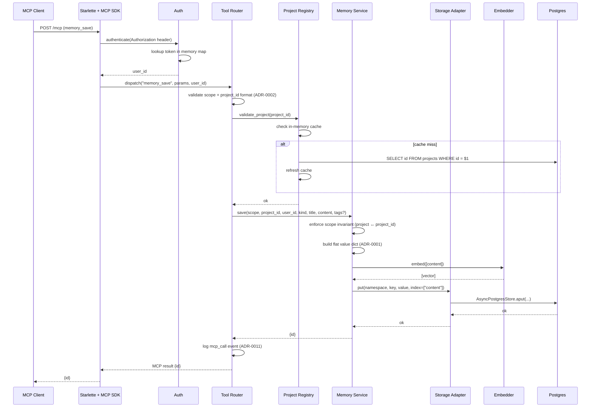
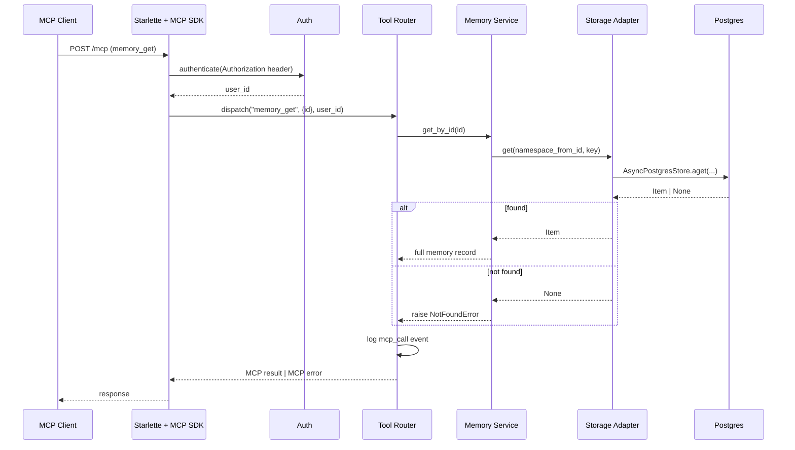
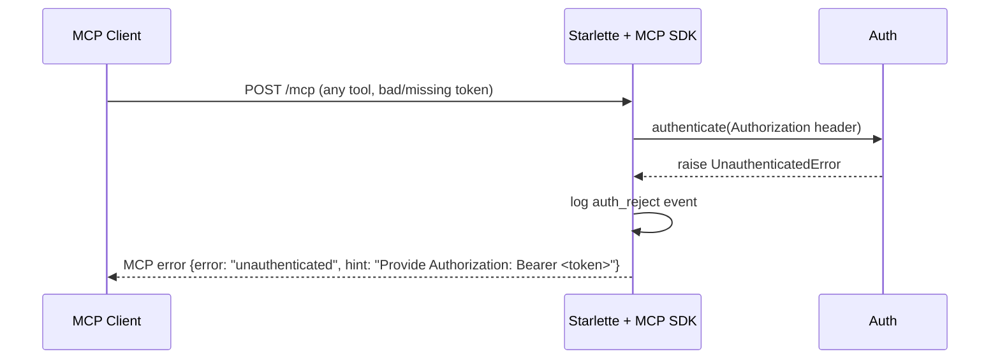
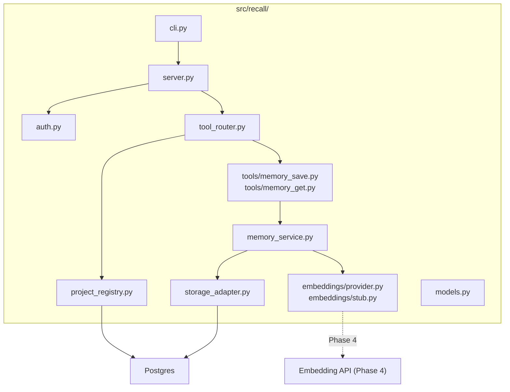

> **Superseded.** This document has been migrated to [docs/design/v2/lld-e1-one-memory-e2e.md](v2/lld-e1-one-memory-e2e.md).
> The v2 revision is synced with ADR-0014 (deferred project registry) and has up-to-date issue references (#86–#91).
> This copy is retained for historical reference only.

# LLD — Epic 1: One Memory, End-to-End

## Document Control

| Field | Value |
|-------|-------|
| Epic | E1 — One memory, end-to-end |
| Phase | 1 |
| Epic issues | #7 (E1.1), #8 (E1.2), #9 (E1.3), #10 (E1.4), #11 (E1.5), #12 (E1.6) |
| HLD components | Auth, Project Registry, Embedder, Memory Service, Tool Router, MCP Transport |
| ADRs | 0001 (flat schema), 0002 (namespace), 0004 (filters), 0006 (transport), 0007 (auth), 0008 (embeddings), 0009 (project registry) |
| Status | Draft |
| Date | 2026-04-12 |

---

## Part A — Human-Reviewable

### Purpose

Deliver the smallest vertical slice that touches every component on the request
path: a bearer-authenticated agent calls `memory_save` to persist a
project-scoped memory (with embedding), then `memory_get` to retrieve it by ID,
over real Streamable HTTP, against real Postgres, with one structured log line
per call. After Phase 1 the architecture is real, not sketched.

### Behavioural Flow — memory_save (happy path)



### Behavioural Flow — memory_get (happy path)



### Behavioural Flow — Authentication failure



### Structural Overview



### Invariants

| # | Invariant | Verification |
|---|-----------|-------------|
| I1 | Every request without a valid bearer token is rejected before any tool runs | Integration test: call memory_save without token → `unauthenticated` error |
| I2 | `scope=project` requires a registered, non-reserved `project_id`; `scope=global` forbids `project_id` | Integration test: save with unknown project → `unknown_project`; save global with project_id → `validation_error` |
| I3 | Namespace is always `(scope, project_id)` with sentinel `"_"` for global (ADR-0002) | Integration test: save global, inspect DB prefix = `global._` |
| I4 | Flat value schema — all filterable fields at root of `value` JSONB (ADR-0001) | Integration test: save memory, raw SQL SELECT value, assert `kind`, `scope`, `title` are top-level keys |
| I5 | Every memory_save generates an embedding; no memory exists without one | Integration test: save, then asearch with query returns the memory |
| I6 | memory_get returns the full record including user_id, created_at, updated_at | Integration test: save then get, assert all fields present |
| I7 | Every tool call emits exactly one structured `mcp_call` log event | Integration test: capture logs, assert one event per call with required fields |
| I8 | Project registry caches and refreshes on miss — a freshly added project works without restart | Integration test: add project via SQL, immediately save memory to it |
| I9 | `project_id` must match `^[a-zA-Z0-9_-]{1,128}$` (ADR-0002) | Unit test: invalid IDs rejected at the API boundary |

### Acceptance Criteria + BDD Specs

```python
@pytest.mark.integration
class TestMemorySaveEndToEnd:
    """Phase 1 exit criterion — save and retrieve over real MCP transport."""

    async def test_save_project_memory_round_trip(
        self, mcp_client, project_id
    ) -> None:
        """Given a valid bearer token and a registered project,
        when memory_save is called with scope=project,
        then an id is returned and memory_get retrieves the full record."""

    async def test_save_global_memory(self, mcp_client) -> None:
        """Given scope=global and no project_id,
        when memory_save is called,
        then the memory is stored under namespace ('global', '_')."""

    async def test_save_fails_without_auth(self, unauthenticated_client) -> None:
        """Given no bearer token,
        when memory_save is called,
        then {error: 'unauthenticated'} is returned."""

    async def test_save_fails_with_unknown_project(
        self, mcp_client
    ) -> None:
        """Given an unregistered project_id,
        when memory_save is called,
        then {error: 'unknown_project'} is returned."""

    async def test_save_validates_scope_invariant(self, mcp_client) -> None:
        """Given scope=global with a project_id,
        when memory_save is called,
        then {error: 'validation_error'} is returned."""

    async def test_structured_log_emitted(
        self, mcp_client, project_id, captured_logs
    ) -> None:
        """Given a successful memory_save,
        then exactly one mcp_call log event is emitted with
        request_id, user_id, project_id, tool='memory_save',
        latency_ms, result_status='ok'."""


@pytest.mark.integration
class TestMemoryGetEndToEnd:

    async def test_get_returns_full_record(
        self, mcp_client, saved_memory_id
    ) -> None:
        """Given a saved memory,
        when memory_get is called with its id,
        then the full record is returned with all fields."""

    async def test_get_not_found(self, mcp_client) -> None:
        """Given a non-existent id,
        when memory_get is called,
        then {error: 'not_found'} is returned."""


class TestAuth:
    """Unit + integration tests for the Auth component."""

    def test_valid_token_resolves_user_id(self) -> None:
        """Given a token in the auth map, authenticate returns user_id."""

    def test_missing_token_raises(self) -> None:
        """Given no Authorization header, authenticate raises UnauthenticatedError."""

    def test_unknown_token_raises(self) -> None:
        """Given an unrecognised token, authenticate raises UnauthenticatedError."""

    def test_auth_file_loaded_from_env(self, tmp_path) -> None:
        """Given RECALL_AUTH_FILE pointing to a JSON file,
        the auth map is loaded at startup."""


class TestProjectRegistry:
    """Unit + integration tests for the Project Registry."""

    def test_valid_project_accepted(self) -> None:
        """Given a registered project_id, validate_project returns ok."""

    def test_unknown_project_rejected(self) -> None:
        """Given an unregistered project_id, validate_project raises UnknownProjectError."""

    def test_cache_miss_refreshes(self) -> None:
        """Given a project added after startup, the registry refreshes on miss."""

    def test_global_reserved_name_rejected(self) -> None:
        """Given project_id='Global', validate_project raises."""

    def test_project_id_format_validation(self) -> None:
        """Given project_id with dots or spaces, validation rejects."""


class TestEmbedderInterface:
    """Unit tests for the EmbeddingsProvider interface and stub."""

    def test_stub_deterministic(self) -> None:
        """Same input → same vector."""

    def test_stub_correct_dim(self) -> None:
        """Vector length matches configured dim."""

    def test_dim_mismatch_fails_fast(self) -> None:
        """Given EMBEDDINGS_DIM != provider.dim, startup raises."""


class TestStorageAdapter:
    """Integration tests for the thin AsyncPostgresStore wrapper."""

    async def test_put_and_get_round_trip(self, store) -> None:
        """aput then aget returns the same value."""

    async def test_namespace_construction(self, store) -> None:
        """Project memory uses ('project', pid); global uses ('global', '_')."""

    async def test_scope_invariant_defence_in_depth(self, store) -> None:
        """Adapter rejects scope=project with project_id='_' before hitting DB."""


class TestMemoryService:
    """Integration tests for save + get orchestration."""

    async def test_save_embeds_then_puts(self, service) -> None:
        """save() calls embed then put, returns an id."""

    async def test_save_builds_flat_value(self, service) -> None:
        """The stored value has kind, scope, title, content, user_id at root."""

    async def test_get_by_id_returns_full_record(self, service) -> None:
        """get_by_id returns all fields including timestamps."""

    async def test_get_by_id_not_found(self, service) -> None:
        """get_by_id raises NotFoundError for unknown id."""
```

---

## Part B — Agent-Implementable

### HLD Coverage Assessment

| HLD Component | Coverage in this LLD |
|---------------|---------------------|
| MCP Transport | MCP SDK Streamable HTTP wiring on the Starlette app from E0.6 |
| Auth | Fully covered — token-file loader, header parsing, contextvar |
| Tool Router | Fully covered — dispatch, validation, error formatting, logging |
| Project Registry | Fully covered — DB table, cache, CLI, reserved name check |
| Memory Service | save and get_by_id covered; search/update/delete are E2/E3 |
| Embedder | Interface + stub fully covered; real providers are E4 |
| Storage Adapter | put and get covered; search is E2 |
| CLI | Extended with `projects add|list|remove` |

### Layer: DB

#### `src/recall/migrations/0002_projects.sql` (already designed in E0.4 LLD)

Already covers the projects table. No additional migrations needed for E1.

### Layer: BE

#### `src/recall/auth.py`

```python
"""Bearer token authentication (ADR-0007)."""

from __future__ import annotations

import json
from pathlib import Path
from dataclasses import dataclass


@dataclass(frozen=True)
class AuthConfig:
    """Immutable token-to-user mapping loaded at startup."""
    token_map: dict[str, str]  # token → user_id


def load_auth_config(auth_file_path: str) -> AuthConfig:
    """Load token map from a JSON file.

    File format: {"<token>": {"user_id": "<id>"}, ...}

    Raises:
        FileNotFoundError: if the file does not exist.
        ValueError: if the file is not valid JSON or has wrong shape.
    """
    ...


def authenticate(auth_config: AuthConfig, authorization_header: str | None) -> str:
    """Extract and validate the bearer token from the Authorization header.

    Args:
        auth_config: The loaded token map.
        authorization_header: The raw Authorization header value, or None.

    Returns:
        The resolved user_id.

    Raises:
        UnauthenticatedError: if the header is missing, malformed, or the
            token is not in the map.
    """
    ...
```

**Key details:**
- The auth file is read once at startup. No hot-reload in v2 (restart to
  rotate tokens, per ADR-0007).
- `authenticate()` is a pure function — no I/O, no DB. Easy to unit test.
- `UnauthenticatedError` is defined in a shared `errors.py` module.

#### `src/recall/project_registry.py`

```python
"""Project registry with in-memory cache (ADR-0009)."""

from __future__ import annotations

import re

PROJECT_ID_PATTERN = re.compile(r"^[a-zA-Z0-9_-]{1,128}$")


class ProjectRegistry:
    """Validates project IDs against the projects table.

    Caches the project list in memory. On a cache miss, refreshes
    once from the database before rejecting.
    """

    def __init__(self, pool: asyncpg.Pool) -> None:
        self._pool = pool
        self._cache: set[str] = set()

    async def refresh(self) -> None:
        """Reload the project list from the database."""
        ...

    async def validate_project(self, project_id: str) -> None:
        """Validate that project_id is registered and well-formed.

        Raises:
            ValidationError: if project_id does not match the format rules.
            UnknownProjectError: if project_id is not in the registry.
        """
        ...

    @staticmethod
    def validate_project_id_format(project_id: str) -> None:
        """Check project_id matches ^[a-zA-Z0-9_-]{1,128}$ (ADR-0002).

        Also rejects the reserved name 'global' (case-insensitive).

        Raises:
            ValidationError: on format violation or reserved name.
        """
        ...
```

**Key details:**
- Cache is a `set[str]` of project IDs. Refreshed via `SELECT id FROM projects`.
- On `validate_project`: check cache → if miss, call `refresh()` → check
  again → if still miss, raise `UnknownProjectError`.
- Format validation is static — no DB needed. Called before cache lookup.

**CLI extension — `recall projects add|list|remove`:**

Added as subcommands in `cli.py`. Each is a thin async wrapper:
- `add`: `INSERT INTO projects (id, display_name, created_by) VALUES (...)`.
  Validates format first.
- `list`: `SELECT id, display_name, created_at FROM projects ORDER BY id`.
  Prints as a table.
- `remove`: `DELETE FROM projects WHERE id = $1`. Succeeds only if no
  memories exist for that project (check `store` table for matching prefix).

#### `src/recall/embeddings/provider.py`

```python
"""Embeddings provider interface (ADR-0008)."""

from __future__ import annotations

from abc import ABC, abstractmethod


class EmbeddingsProvider(ABC):
    """Abstract base for embedding providers.

    All providers must declare their vector dimension and implement
    batch embedding.
    """

    @property
    @abstractmethod
    def dim(self) -> int:
        """The dimensionality of produced vectors."""
        ...

    @abstractmethod
    async def embed(self, texts: list[str]) -> list[list[float]]:
        """Generate embeddings for a batch of texts.

        Args:
            texts: Non-empty list of strings to embed.

        Returns:
            One vector per input text, each of length self.dim.

        Raises:
            EmbeddingError: if generation fails after retry.
        """
        ...
```

**Key details:**
- The interface is `async` because the OpenAI provider (E4) will make HTTP
  calls. The stub provider can implement it synchronously via
  `run_in_executor` or simply return immediately (hash computation is fast).
- `dim` is a property, not a method — it's a fixed value per provider instance.
- The stub from E0.5 (`StubEmbeddingsProvider`) implements this interface.
  It moves from a plain class to inheriting `EmbeddingsProvider`.

#### `src/recall/storage_adapter.py`

```python
"""Thin wrapper over AsyncPostgresStore (ADR-0001, ADR-0002)."""

from __future__ import annotations

from langgraph.store.postgres import AsyncPostgresStore


GLOBAL_SENTINEL = "_"


class StorageAdapter:
    """Namespace-aware wrapper over AsyncPostgresStore.

    Enforces the (scope, project_id) namespace shape (ADR-0002)
    and the scope invariant as defence-in-depth.
    """

    def __init__(self, store: AsyncPostgresStore) -> None:
        self._store = store

    async def put(
        self,
        scope: str,
        project_id: str,
        key: str,
        value: dict[str, Any],
        index: list[str] | Literal[False] | None = None,
    ) -> None:
        """Store a memory record.

        Args:
            scope: "project" or "global".
            project_id: The project ID, or GLOBAL_SENTINEL for global scope.
            key: The memory ID (UUID).
            value: Flat value dict (ADR-0001).
            index: Fields to embed, or False to skip embedding.

        Raises:
            ValidationError: if scope/project_id invariant is violated.
        """
        namespace = self._build_namespace(scope, project_id)
        await self._store.aput(namespace, key, value, index=index)

    async def get(
        self,
        scope: str,
        project_id: str,
        key: str,
    ) -> Item | None:
        """Retrieve a memory by namespace + key.

        Returns None if not found.
        """
        namespace = self._build_namespace(scope, project_id)
        return await self._store.aget(namespace, key)

    @staticmethod
    def _build_namespace(scope: str, project_id: str) -> tuple[str, str]:
        """Construct the 2-tuple namespace, enforcing the scope invariant.

        Raises:
            ValidationError: if scope=global and project_id != '_',
                or scope=project and project_id == '_'.
        """
        if scope == "global" and project_id != GLOBAL_SENTINEL:
            raise ValidationError(
                "Global scope requires project_id='_'"
            )
        if scope == "project" and project_id == GLOBAL_SENTINEL:
            raise ValidationError(
                "Project scope must not use the reserved sentinel '_'"
            )
        if scope not in ("global", "project"):
            raise ValidationError(f"Invalid scope: {scope}")
        return (scope, project_id)
```

**Key details:**
- The adapter is deliberately thin — it translates Recall's domain concepts
  (scope, project_id) into the store's namespace tuple and delegates.
- Defence-in-depth: validates the scope invariant in Python even though the
  DB CHECK constraint also enforces it. Belt and braces.
- `Item` is LangGraph's `Item` type from `langgraph.store.base`.

#### `src/recall/memory_service.py`

```python
"""Core memory lifecycle — save and get (Phase 1). Search/update/delete in later phases."""

from __future__ import annotations

import uuid
from datetime import datetime, timezone
from typing import Any


class MemoryService:
    """Orchestrates memory operations across storage and embeddings."""

    def __init__(
        self,
        storage: StorageAdapter,
        embedder: EmbeddingsProvider,
    ) -> None:
        self._storage = storage
        self._embedder = embedder

    async def save(
        self,
        scope: str,
        project_id: str,
        user_id: str,
        kind: str,
        title: str,
        content: str,
        tags: list[str] | None = None,
        metadata: dict[str, Any] | None = None,
    ) -> str:
        """Save a new memory.

        1. Enforce scope invariant.
        2. Build the flat value dict (ADR-0001).
        3. Delegate to storage adapter (embedding handled by store index).
        4. Return the generated ID.

        Args:
            scope: "project" or "global".
            project_id: Project ID or "_" for global.
            user_id: Resolved from auth.
            kind: Free-form category (decision, convention, gotcha, etc.).
            title: Short title for the memory.
            content: Full content text.
            tags: Optional list of tag strings.
            metadata: Optional additional metadata dict.

        Returns:
            The generated memory ID (UUID string).

        Raises:
            ValidationError: scope invariant violation.
            EmbeddingError: embedding generation failed.
        """
        memory_id = str(uuid.uuid4())
        now = datetime.now(timezone.utc).isoformat()

        value: dict[str, Any] = {
            "scope": scope,
            "project_id": project_id,
            "user_id": user_id,
            "kind": kind,
            "title": title,
            "content": content,
            "tags": tags or [],
            "metadata": metadata or {},
            "created_at": now,
            "updated_at": now,
        }

        await self._storage.put(
            scope=scope,
            project_id=project_id,
            key=memory_id,
            value=value,
            index=["content"],  # embed the content field
        )

        return memory_id

    async def get_by_id(self, memory_id: str) -> dict[str, Any]:
        """Retrieve a memory by ID.

        The ID encodes which namespace to look in — but we don't have that
        mapping in Phase 1. Strategy: store a lightweight index of
        id → (scope, project_id) in the value itself, and search by listing
        namespaces if needed.

        Simpler approach for Phase 1: memory_get requires the caller to
        pass scope + project_id alongside the id (or we store a global
        lookup). See design note below.

        Raises:
            NotFoundError: memory not found.
        """
        ...
```

**Design note — memory_get ID resolution:**

The `AsyncPostgresStore.aget()` requires a namespace tuple + key. The MCP
tool `memory_get` accepts only an `id`. Two approaches:

1. **Require scope + project_id in the get call.** Simplest, but the
   requirements say `memory_get` takes only `id` (tool reference table).
2. **Store a reverse index.** A separate table or a known namespace
   `("_index", "_")` mapping `id → (scope, project_id)`.
3. **Search across all namespaces.** Use `alist_namespaces` then `aget` on
   each. Correct but slow for many projects.
4. **Encode scope + project_id in the key.** E.g. `project:myproj:uuid`.
   Changes the key format.

**Recommended approach: option 2 — a reverse index in the store itself.**
On `save`, also `aput` into namespace `("_index", "_")` with key=memory_id
and value=`{"scope": scope, "project_id": project_id}`. On `get_by_id`,
first `aget` the index entry to find the namespace, then `aget` the actual
record. Two reads per get, but gets are infrequent compared to search.
The index entry has `index=False` (no embedding needed).

#### `src/recall/models.py`

```python
"""Domain models and the flat value schema (ADR-0001)."""

from __future__ import annotations

from pydantic import BaseModel, Field
from datetime import datetime


class MemoryRecord(BaseModel):
    """The flat value schema stored in AsyncPostgresStore.

    All fields are at the root of the JSONB `value` column.
    This model IS the stored shape — no hoist/unhoist (ADR-0001).
    """

    scope: str                          # "project" | "global"
    project_id: str                     # project ID or "_" for global
    user_id: str                        # who created/last updated
    kind: str                           # free-form: decision, convention, etc.
    title: str                          # short title
    content: str                        # full content
    tags: list[str] = Field(default_factory=list)
    metadata: dict[str, Any] = Field(default_factory=dict)
    created_at: str                     # ISO-8601 UTC
    updated_at: str                     # ISO-8601 UTC


class MemoryResponse(BaseModel):
    """Full memory record returned by memory_get."""

    id: str
    scope: str
    project_id: str
    user_id: str
    kind: str
    title: str
    content: str
    tags: list[str]
    metadata: dict[str, Any]
    created_at: str
    updated_at: str
```

#### `src/recall/errors.py`

```python
"""Shared error types and structured error formatting."""


class RecallError(Exception):
    """Base error for all Recall domain errors."""

    def __init__(self, error: str, hint: str) -> None:
        self.error = error
        self.hint = hint
        super().__init__(error)


class UnauthenticatedError(RecallError):
    def __init__(self) -> None:
        super().__init__(
            error="unauthenticated",
            hint="Provide Authorization: Bearer <token> header.",
        )


class UnknownProjectError(RecallError):
    def __init__(self, project_id: str) -> None:
        super().__init__(
            error="unknown_project",
            hint=f"Project '{project_id}' is not registered. Use 'recall projects add'.",
        )


class ValidationError(RecallError):
    def __init__(self, detail: str) -> None:
        super().__init__(
            error="validation_error",
            hint=detail,
        )


class NotFoundError(RecallError):
    def __init__(self, memory_id: str) -> None:
        super().__init__(
            error="not_found",
            hint=f"Memory '{memory_id}' does not exist. Verify the ID or search first.",
        )


class EmbeddingError(RecallError):
    def __init__(self, detail: str = "") -> None:
        super().__init__(
            error="embedding_failed",
            hint=f"Embedding generation failed. {detail}. Retry or check embedding provider.",
        )
```

#### `src/recall/tool_router.py`

```python
"""MCP tool registration, dispatch, validation, and error formatting."""

from __future__ import annotations

import time
import structlog

log = structlog.get_logger()


class ToolRouter:
    """Registers MCP tools and dispatches calls with cross-cutting concerns.

    Responsibilities:
    - Validate common parameters (scope, project_id)
    - Dispatch to MemoryService
    - Catch RecallError and format as structured MCP errors
    - Emit one mcp_call log event per call (ADR-0011)
    """

    def __init__(
        self,
        memory_service: MemoryService,
        project_registry: ProjectRegistry,
        auth_config: AuthConfig,
    ) -> None:
        self._memory_service = memory_service
        self._project_registry = project_registry
        self._auth_config = auth_config

    async def handle_tool_call(
        self,
        tool_name: str,
        params: dict[str, Any],
        user_id: str,
    ) -> dict[str, Any]:
        """Dispatch a tool call with logging and error handling.

        Args:
            tool_name: The MCP tool name.
            params: The tool parameters.
            user_id: Resolved from auth.

        Returns:
            The tool result dict.

        Raises:
            Nothing — errors are caught and returned as structured dicts.
        """
        start = time.monotonic()
        try:
            result = await self._dispatch(tool_name, params, user_id)
            elapsed = (time.monotonic() - start) * 1000
            log.info(
                "mcp_call",
                tool=tool_name,
                user_id=user_id,
                project_id=params.get("project_id", ""),
                latency_ms=round(elapsed, 1),
                result_status="ok",
            )
            return result
        except RecallError as e:
            elapsed = (time.monotonic() - start) * 1000
            log.info(
                "mcp_call",
                tool=tool_name,
                user_id=user_id,
                project_id=params.get("project_id", ""),
                latency_ms=round(elapsed, 1),
                result_status=e.error,
            )
            return {"error": e.error, "hint": e.hint}

    async def _dispatch(
        self,
        tool_name: str,
        params: dict[str, Any],
        user_id: str,
    ) -> dict[str, Any]:
        """Route to the appropriate service method."""
        if tool_name == "memory_save":
            return await self._handle_memory_save(params, user_id)
        elif tool_name == "memory_get":
            return await self._handle_memory_get(params)
        else:
            raise ValidationError(f"Unknown tool: {tool_name}")

    async def _handle_memory_save(
        self, params: dict[str, Any], user_id: str
    ) -> dict[str, Any]:
        """Validate and delegate memory_save."""
        # Extract and validate params
        scope = params.get("scope", "")
        project_id = params.get("project_id", "_" if scope == "global" else "")
        kind = params.get("kind", "")
        title = params.get("title", "")
        content = params.get("content", "")

        # Validate required fields
        for field_name, value in [("scope", scope), ("kind", kind),
                                   ("title", title), ("content", content)]:
            if not value:
                raise ValidationError(f"Missing required field: {field_name}")

        # Validate project
        if scope == "project":
            await self._project_registry.validate_project(project_id)

        memory_id = await self._memory_service.save(
            scope=scope,
            project_id=project_id if scope == "project" else "_",
            user_id=user_id,
            kind=kind,
            title=title,
            content=content,
            tags=params.get("tags"),
            metadata=params.get("metadata"),
        )
        return {"id": memory_id}

    async def _handle_memory_get(
        self, params: dict[str, Any]
    ) -> dict[str, Any]:
        """Validate and delegate memory_get."""
        memory_id = params.get("id", "")
        if not memory_id:
            raise ValidationError("Missing required field: id")
        record = await self._memory_service.get_by_id(memory_id)
        return record
```

#### MCP tool declarations

The MCP SDK tool declarations are registered on the MCP server instance.
Each tool has an agent-oriented description following Story 4.2.

```python
# Tool declarations (registered in server.py MCP setup)

MEMORY_SAVE_SCHEMA = {
    "name": "memory_save",
    "description": (
        "Store a new memory. Use this when the agent learns something worth "
        "remembering across sessions: a decision, convention, gotcha, or "
        "any other durable fact.\n\n"
        "Scope decision rule: if this fact would still be true and useful "
        "in a brand-new empty repo tomorrow, use scope='global'. Otherwise "
        "use scope='project'. When in doubt, prefer 'project'.\n\n"
        "Parameters:\n"
        "- scope (required): 'project' or 'global'\n"
        "- project_id (required if scope='project'): the project identifier\n"
        "- kind (required): category — e.g. 'decision', 'convention', "
        "'gotcha', 'component', 'episode', 'instruction'\n"
        "- title (required): short descriptive title\n"
        "- content (required): the full memory content\n"
        "- tags (optional): list of string tags\n"
        "- metadata (optional): additional key-value pairs"
    ),
    # JSON Schema for parameters omitted for brevity — follows the
    # tool reference table in requirements.
}

MEMORY_GET_SCHEMA = {
    "name": "memory_get",
    "description": (
        "Fetch the complete record of a memory by its ID. Use this after "
        "finding a memory via memory_search to read the full content "
        "(search returns snippets only).\n\n"
        "Parameters:\n"
        "- id (required): the memory ID returned by memory_save or memory_search"
    ),
}
```

### Internal Decomposition

| Module | Responsibility | Boundary |
|--------|---------------|----------|
| `auth.py` | Token lookup, user_id resolution | Pure function, no I/O |
| `project_registry.py` | Project validation, caching | Reads DB for cache refresh |
| `embeddings/provider.py` | Abstract interface | No implementation |
| `embeddings/stub.py` | Deterministic test/dev provider | No I/O |
| `storage_adapter.py` | Namespace construction, scope invariant, delegate to store | Thin wrapper over AsyncPostgresStore |
| `memory_service.py` | Orchestrate save (build value → put) and get (index lookup → aget) | Depends on storage + embedder |
| `tool_router.py` | Dispatch, validation, error formatting, logging | Depends on service + registry + auth |
| `models.py` | Pydantic models for the flat value schema | Pure data |
| `errors.py` | Domain error types with {error, hint} shape | Pure data |

### Tasks

| # | Task (E1.N) | Summary | Files touched | Depends on |
|---|-------------|---------|---------------|------------|
| 1 | E1.1 | Auth component — token-file loader, authenticate(), UnauthenticatedError | `src/recall/auth.py`, `src/recall/errors.py`, `tests/test_auth.py` | E0.1 |
| 2 | E1.2 | Project registry — cache, validate, CLI commands | `src/recall/project_registry.py`, `src/recall/cli.py`, `tests/test_project_registry.py` | E0.4 |
| 3 | E1.3 | Embedder interface + stub upgrade | `src/recall/embeddings/provider.py`, `src/recall/embeddings/stub.py`, `tests/test_embeddings.py` | E0.5 |
| 4 | E1.4 | Storage adapter — put/get with namespace construction | `src/recall/storage_adapter.py`, `src/recall/models.py`, `tests/test_storage_adapter.py` | E1.3 |
| 5 | E1.5 | Memory Service — save + get_by_id with reverse index | `src/recall/memory_service.py`, `tests/test_memory_service.py` | E1.3, E1.4 |
| 6 | E1.6 | Tool Router + MCP wiring for memory_save + memory_get | `src/recall/tool_router.py`, `src/recall/server.py`, `tests/test_tool_router.py`, `tests/test_e2e_phase1.py` | E1.1, E1.2, E1.5 |

### Execution Waves (within E1)

| Wave | Tasks | Blocked by | Notes |
|------|-------|------------|-------|
| 1 | E1.1, E1.2, E1.3 | Phase 0 | Parallelisable — no shared files |
| 2 | E1.4 | E1.3 | Storage adapter needs embedder interface |
| 3 | E1.5 | E1.3, E1.4 | Memory service needs both |
| 4 | E1.6 | E1.1, E1.2, E1.5 | Tool router integrates everything |
