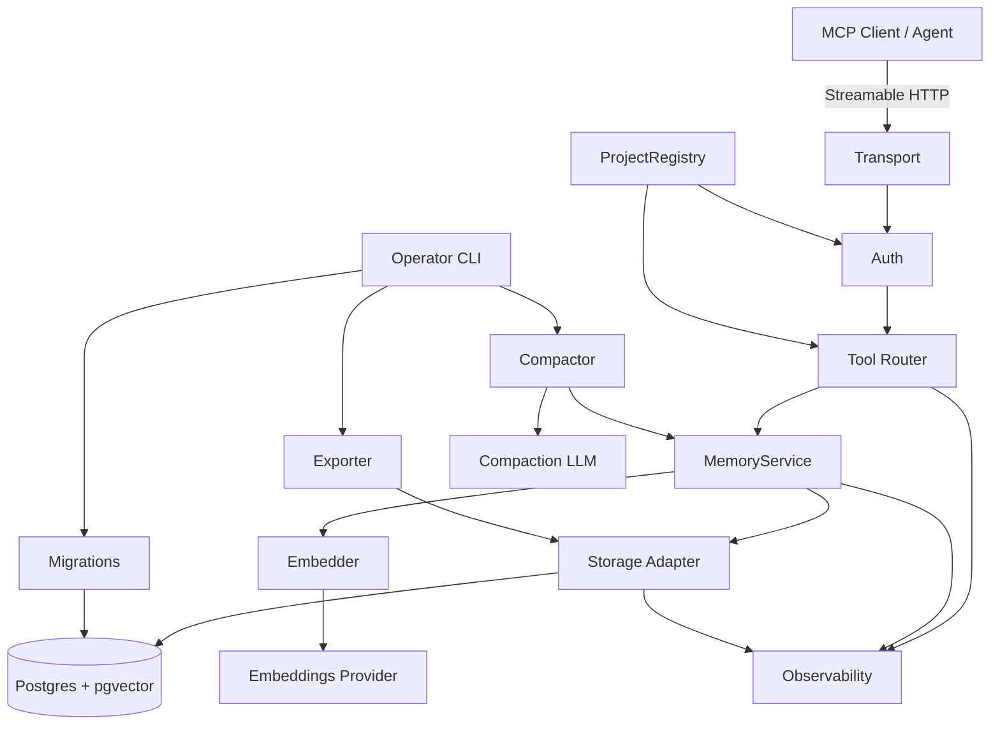
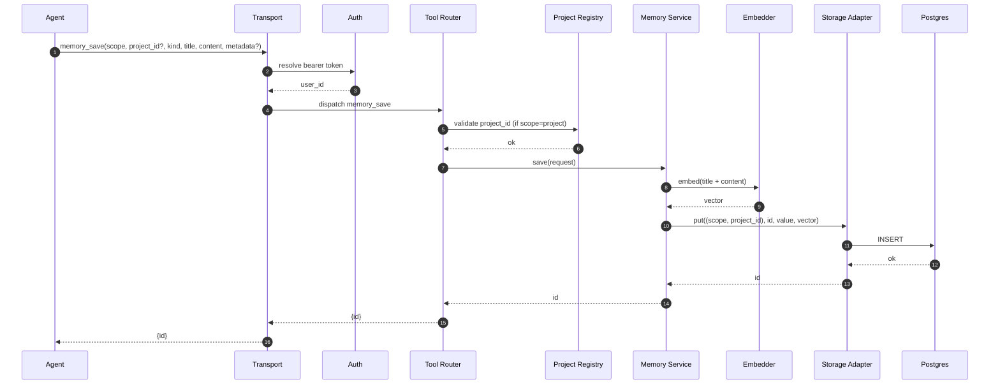
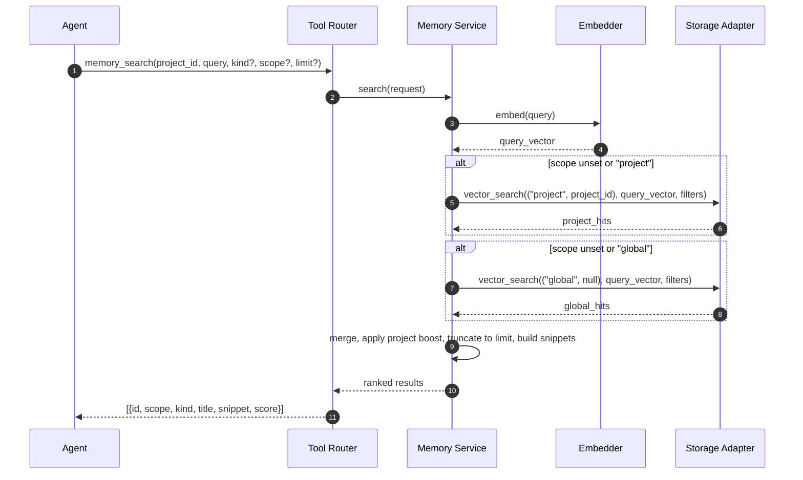
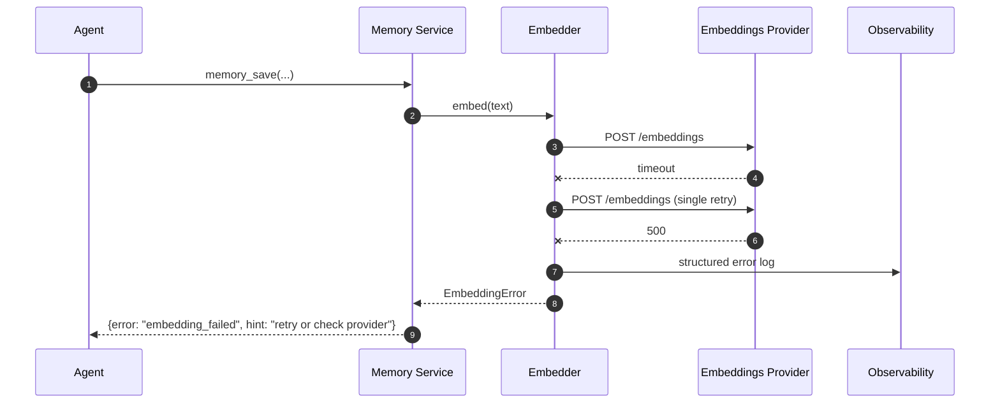
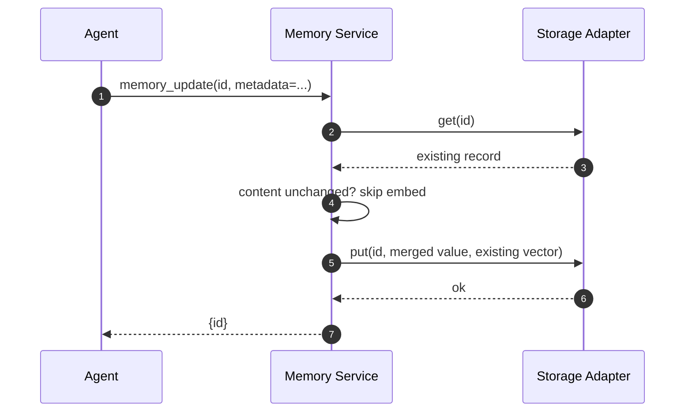
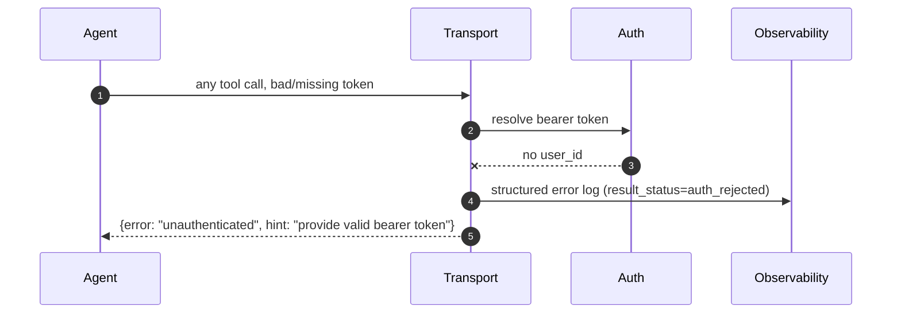

# Recall v1 — High-Level Design

**Status:** draft
**Date:** 2026-04-09
**Source of truth for requirements:** [REQUIREMENTS.md](../../REQUIREMENTS.md)
**Load-bearing ADRs:** [0001](../adr/0001-flat-value-schema.md), [0002](../adr/0002-namespace-shape.md), [0003](../adr/0003-ttl-sweeper-ownership.md), [0004](../adr/0004-filter-limitations.md)

This document covers Levels 1–3 of the design-down process: **Capabilities**, **Components**, and **Interactions**. Level 4 (per-task detail) is produced later by `/architect` as LLDs.

---

## Level 1 — Capabilities

Each capability is a system-level promise derived from one or more requirements. Components and technology are deliberately absent at this level.

### C1. Persist a memory
The system shall durably store a memory record described by `(scope, project_id?, kind, title, content, metadata, user_id)` and return a stable identifier. A record is bound either to a single project or to the global scope; the two are mutually exclusive. *(S1.1, S1.7, S1.8)*

### C2. Embed on meaningful change
The system shall compute a semantic embedding for a memory on creation and whenever its textual content changes, and only then. Metadata-only updates shall not trigger re-embedding. *(S1.2)*

### C3. Semantic + structured search across project and global
The system shall return a single ranked list of memories matching a natural-language query, optionally filtered by `kind`, `user_id`, and `scope`. A project-scoped search shall transparently include `scope=global` hits, with each result tagged by its scope and project memories receiving a small ranking boost on ties. Cross-project search is not offered. *(S1.3)*

### C4. Fetch, update, and delete by id
The system shall expose point operations to retrieve a full record, update its content or metadata, and delete it, all by stable id. *(S1.4, S1.5, S1.6)*

### C5. Agent-facing tool surface
The system shall present a small set (≤ 6) of MCP tools whose descriptions are self-sufficient API docs for an LLM caller. Errors shall be structured so the caller can recover without a human. *(S2.1–S2.5, design principle 1)*

### C6. Scope and identity isolation
The system shall authenticate every request, resolve a `user_id`, and enforce that storage is partitioned by `(scope, project_id)`. `user_id` shall never be part of the storage namespace — it is an audit attribute only. *(S3.1–S3.8)*

### C7. Self-improving instructions as ordinary memories
The system shall treat behavioural guidance the agent writes for itself as memories of `kind=instruction`, retrievable on demand via search. There is no dedicated instruction endpoint, and instructions are never auto-prepended to agent context. *(S4.1–S4.5, design principle 3)*

### C8. Instruction compaction
The system shall, on demand or on a schedule, run an LLM-driven job that merges near-duplicate instructions, drops stale ones, and maintains a priority field so on-demand search remains high-signal. *(S4.6)*

### C9. Shared-infrastructure deployment
The system shall run as a single container against a Postgres+pgvector instance, configured entirely by environment variables, with health probes and an automatic or explicit schema-migration step. *(S5.1–S5.6)*

### C10. Observability
The system shall emit one structured JSON log event per MCP call with a fixed field set, and shall support OpenTelemetry auto-instrumentation for HTTP, database, and outbound HTTP, off by default and activated solely by the presence of an OTLP endpoint. *(S6.3, S6.3a)*

### C11. Quality and safety
The system shall be covered by integration tests that hit a real Postgres, enforce auth rejection, enforce project isolation, guarantee that embedding failures surface as structured errors rather than silent empty results, and support per-project export for backup. *(S6.1, S6.2, S6.4, S6.5, S6.6)*

### C12. Garbage collection
The system shall provide an on-demand job that prunes unused memories, flags near-duplicates, and runs the instruction-compaction pass. LLM-driven scope reclassification is a later increment. *(S6.7)*

### C13. Schema lifecycle
The system shall ship a migration command that creates or upgrades the schema and enforces at startup that the configured embedding dimension matches the column definition. *(S1.9, S5.5, S5.1)*

**Coverage note.** Every story `S1.x`–`S6.x` from REQUIREMENTS.md is intended to map to at least one capability above. The Step 3 drift scan is the formal check.

---

## Level 2 — Components

Components are abstract. Concrete library choices live in ADRs and LLDs, not here.

### Transport
- **Purpose:** Terminate the Streamable HTTP MCP connection and dispatch tool calls.
- **Responsibilities:** parse and validate the MCP envelope; assign `request_id`, `trace_id`, `span_id`; hand the call to Auth; serialise responses and errors.
- **Non-responsibilities:** no business logic; no knowledge of memory semantics; no direct DB access.
- **Depends on:** Auth, Tool Router, Observability.

### Auth
- **Purpose:** Resolve the caller's `user_id` from a shared bearer token per request and reject unauthenticated calls.
- **Responsibilities:** bearer-token lookup; `user_id` injection into the call context; hard-reject when no `user_id` resolves.
- **Non-responsibilities:** not an identity provider; no role/permission model beyond presence of a valid token; no project-level ACLs.
- **Depends on:** an out-of-band token configuration source.

### Project Registry
- **Purpose:** Own the list of valid `project_id`s and reject reserved names.
- **Responsibilities:** resolve a `project_id` passed by the agent; reject `global` as a project name (case-insensitive); expose the current project list.
- **Non-responsibilities:** not a CRUD surface for projects in v1 — projects are configured out-of-band.
- **Depends on:** a configuration source (config file or `projects` table).

### Tool Router
- **Purpose:** Expose the five MCP tools and translate them into Memory Service calls.
- **Responsibilities:** declare tool schemas and descriptions (the API docs for the LLM); validate arguments; enforce the scope/project_id mutual-exclusion at the tool boundary; shape structured `{error, hint}` responses.
- **Non-responsibilities:** no persistence; no embedding; no ranking logic.
- **Depends on:** Memory Service, Project Registry, Observability.

### Memory Service
- **Purpose:** Single entry point for every memory operation; the only component that both reads/writes the Store and calls the Embedder.
- **Responsibilities:** enforce the `(scope, project_id)` invariant on writes; decide when to re-embed (S1.2); orchestrate search across project+global with ranking boost; assemble snippets for search results; delegate persistence to the Store.
- **Non-responsibilities:** does not implement the transport; does not own auth; does not talk to the database directly.
- **Depends on:** Storage Adapter, Embedder, Observability.

### Storage Adapter
- **Purpose:** Thin wrapper over the Postgres key/value+vector store, honouring the namespace shape fixed by ADR-0002 and the flat value schema fixed by ADR-0001.
- **Responsibilities:** put/get/delete/search by `(scope, project_id)` namespace; expose the subset of filter operators that actually work (per ADR-0004); enforce the CHECK constraint from S1.7 at write time as defence in depth.
- **Non-responsibilities:** no semantic reasoning; no cross-namespace joins; no schema migrations.
- **Depends on:** Postgres+pgvector.

### Embedder
- **Purpose:** Produce vectors for text on demand.
- **Responsibilities:** call the configured embeddings provider; enforce timeout and single retry; surface failures as structured errors (S6.5); validate `EMBEDDINGS_DIM` against the schema at startup.
- **Non-responsibilities:** does not cache; does not re-rank; does not decide *when* to embed — that is the Memory Service's call.
- **Depends on:** Embeddings Provider (sentence-transformers in-process, or any OpenAI-compatible HTTP endpoint).

### Observability
- **Purpose:** Provide structured JSON logging and OTEL auto-instrumentation wiring.
- **Responsibilities:** configure `structlog`; ensure every MCP call emits exactly one event with the fixed field set; wire OTEL auto-instrumentation for HTTP, asyncpg, and outbound HTTP; activate the exporter only when `OTEL_EXPORTER_OTLP_ENDPOINT` is set.
- **Non-responsibilities:** no custom spans in v1; no metrics in v1; no log shipping.
- **Depends on:** nothing internal.

### Migrations
- **Purpose:** Create and upgrade the schema.
- **Responsibilities:** ship DDL; run automatically on startup behind a flag or via `recall db migrate`; verify the `vector(N)` dimension matches `EMBEDDINGS_DIM`.
- **Non-responsibilities:** not a general-purpose ORM; no data backfills beyond what a schema change demands.
- **Depends on:** Postgres.

### Compactor
- **Purpose:** Run the LLM-driven instruction compaction job (S4.6) and the near-duplicate flagging pass of garbage collection (S6.7).
- **Responsibilities:** enumerate candidate instructions via Memory Service; call the compaction LLM; merge/drop/priority-update via Memory Service; be invokable via CLI and safe to schedule.
- **Non-responsibilities:** not part of the request path; no MCP surface.
- **Depends on:** Memory Service, Compaction LLM provider.

### Exporter
- **Purpose:** Dump a project's memories to JSON for backup/inspection (S6.4).
- **Responsibilities:** stream all rows for a given project via the Storage Adapter; emit newline-delimited JSON.
- **Non-responsibilities:** no import; no filtering beyond project scope in v1.

### Operator CLI
- **Purpose:** `recall …` command group that fronts Migrations, Compactor, Exporter, and `serve`.
- **Responsibilities:** argument parsing; env-var resolution; invoking the right component.
- **Non-responsibilities:** no business logic beyond dispatch.

### External boundaries
- **Embeddings Provider** — sentence-transformers (in-process) or any OpenAI-compatible HTTP endpoint.
- **Compaction LLM** — OpenAI-compatible HTTP endpoint, only required when the Compactor runs.
- **Postgres + pgvector** — the only datastore.

---

## Level 3 — Interactions

Five flows worth pinning at this stage: the happy path for the primary capability, the primary error path, a cross-scope search, a metadata-only update (to exercise the re-embed decision), and an authentication rejection. Each diagram names the contracts that Level 4 will need to lock down, without specifying them.

### I1. Save a memory (happy path)

**Contracts to lock at Level 4:** the exact `value` JSON layout honouring ADR-0001; how `id` is generated; what "title + content" concatenation looks like for embedding.

### I2. Search across project + global

**Contracts to lock at Level 4:** the exact ranking-boost formula; snippet construction rules (default/hard-cap chars); whether two separate queries or one namespace-union query is cheaper in the chosen store API.

### I3. Embedding provider failure (error path)

**Contracts to lock at Level 4:** timeout duration; error code vocabulary exposed to the agent.

### I4. Metadata-only update (no re-embed)

**Contracts to lock at Level 4:** how partial updates merge into the flat value schema from ADR-0001; how "content unchanged" is detected without re-hashing the whole record.

### I5. Authentication rejection

**Contracts to lock at Level 4:** HTTP status mapping; whether the MCP error envelope carries the same `{error, hint}` shape as tool errors.

---

## Traceability summary

| Requirement | Capability | Primary components |
|---|---|---|
| S1.1, S1.7, S1.8 | C1 | Memory Service, Storage Adapter |
| S1.2 | C2 | Memory Service, Embedder |
| S1.3 | C3 | Memory Service, Storage Adapter |
| S1.4–S1.6 | C4 | Memory Service, Storage Adapter |
| S1.9, S5.5 | C13 | Migrations, Operator CLI |
| S2.1–S2.5 | C5 | Tool Router, Transport |
| S3.1–S3.8 | C6 | Auth, Project Registry, Transport |
| S4.1–S4.5 | C7 | Tool Router, Memory Service |
| S4.6 | C8 | Compactor, Memory Service |
| S5.1–S5.6 | C9 | Operator CLI, Transport, Migrations |
| S6.1, S6.2, S6.6 | C11 | (test infra — cross-cutting) |
| S6.3, S6.3a | C10 | Observability |
| S6.4 | C11 | Exporter |
| S6.5 | C11 | Embedder |
| S6.7 | C12 | Compactor, Operator CLI |

The Step 3 drift scan is the authoritative check; this table is a convenience index.
