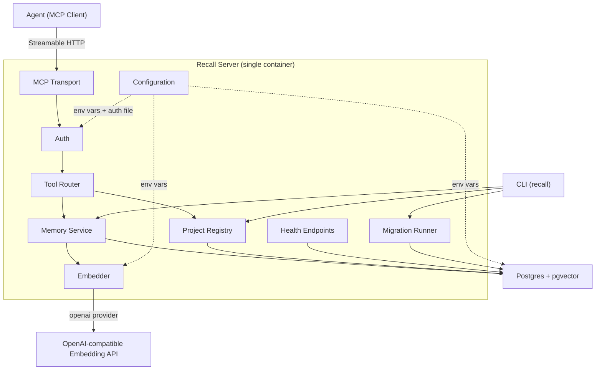
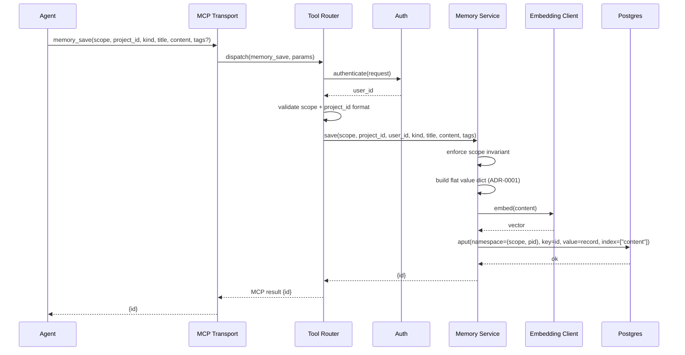
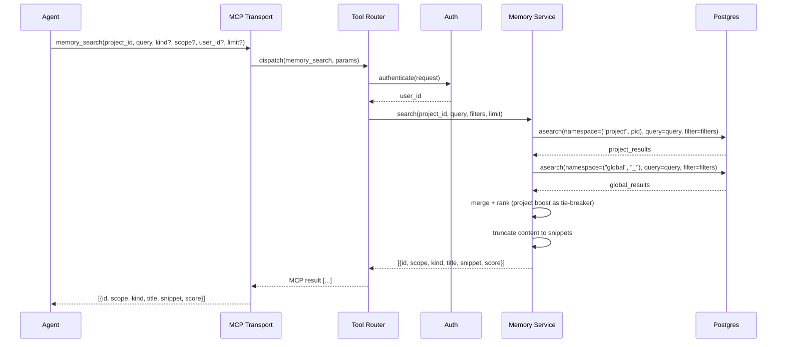
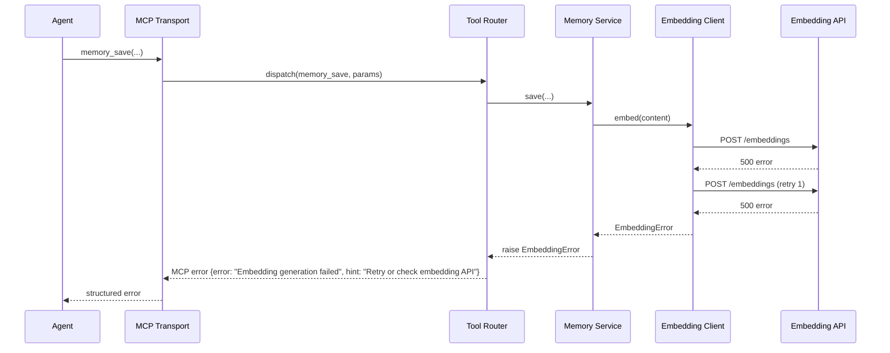
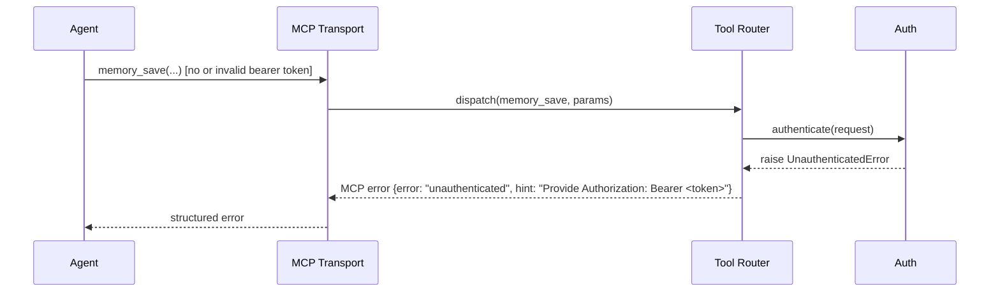

# Recall V2 — High-Level Design

**Version:** 1.0
**Date:** 2026-04-12
**Status:** Draft
**Requirements:** [docs/requirements/v2-requirements.md](../requirements/v2-requirements.md)

---

## Level 1 — Capabilities

Each capability maps to one or more requirement epics. Together they describe
what the system does at the boundary, without naming components or technology.

### C1. Persist structured memories

The system shall accept a memory record from an agent — comprising scope,
kind, title, content, optional tags, and optional metadata — and persist it
durably so that the same or a different agent session can retrieve it later.
Scope determines isolation: a memory is either bound to a specific project or
marked global. The scope invariant (project requires a project ID; global
forbids one) is enforced at both the application and database level.

Tags are stored as metadata on the record but are **not filterable** in v2
search. Tag-based filtering is deferred until a workable approach is
confirmed (see ADR-0004 amendment). This avoids the raw-SQL escape hatch and
keeps the "boring storage" principle intact.

**Covers:** Epic 1 (Stories 1.1, 1.2, 1.3), Epic 5 (Story 5.4)

### C2. Update and delete memories

The system shall allow an agent to modify the content, tags, or metadata of an
existing memory, or to permanently remove it. Scope and project ID are
immutable after creation. Content changes trigger re-embedding; metadata-only
changes do not.

**Covers:** Epic 1 (Stories 1.4, 1.5)

### C3. Discover memories by meaning

The system shall accept a natural-language query and return a ranked list of
semantically similar memories. When searching within a project, both
project-scoped and global memories are included by default, with project
results receiving a tie-breaking boost. Results are snippets (not full
content) to conserve the agent's context window; full records are available by
ID.

**Covers:** Epic 2 (Stories 2.1, 2.2, 2.4, 2.5)

### C4. Filter memories by structure

The system shall support narrowing search results by kind, scope, and
user ID. Filters compose conjunctively (AND). Combined with semantic ranking,
this lets the agent ask "show me decisions about authentication in this
project" without scanning everything. Tag filtering is deferred (see C1).

**Covers:** Epic 2 (Story 2.3)

### C5. Self-improving instructions as ordinary memories

The system shall treat behavioural guidance the agent writes for itself as
memories with `kind=instruction`, retrievable on demand via `memory_search`.
There is no dedicated instruction endpoint. Instructions are stored at
global scope (user/workflow preferences) or project scope (repo-specific
rules) using the same `memory_save` / `memory_update` / `memory_delete`
tools as any other memory. The agent retrieves them via
`memory_search(kind="instruction")` when it needs guidance — on-demand
retrieval avoids polluting the context window.

**Covers:** Epic 3 (Stories 3.1, 3.2, 3.3, 3.4)

### C6. Expose tools over MCP

The system shall present its capabilities as at most 6 MCP tools over the
Streamable HTTP transport. Tool descriptions are written for LLM
comprehension — they tell the agent when to call, what to pass, and include
the scope decision rule. Errors are structured objects with a message and a
recovery hint.

**Covers:** Epic 4 (Stories 4.1, 4.2, 4.3, 4.4)

### C7. Authenticate users and isolate projects

The system shall authenticate every request via a shared bearer token
(ADR-0007), resolving the token to a `user_id` that is recorded on each
memory. All users within a project share the same memory namespace — there
is no per-user privacy within a project. Projects are registered in a
database table (ADR-0009) and managed via CLI; the reserved name `global`
(case-insensitive) is rejected at the schema level. Project IDs are
validated against the character rules in ADR-0002.

**Covers:** Epic 5 (Stories 5.1, 5.2, 5.3, 5.4, 5.5, 5.6)

### C8. Deploy as shared infrastructure

The system shall run as a single Docker container, configured entirely via
environment variables, connecting to an external Postgres instance. Schema
migrations run via CLI or automatically on startup. Health endpoints
(`/healthz`, `/readyz`) support orchestrator probes. A Docker Compose file
enables local development with zero external dependencies.

**Covers:** Epic 6 (Stories 6.1, 6.2, 6.3, 6.4, 6.5)

### C9. Guide agent integration

The system shall ship reference instructions (e.g., sample CLAUDE.md
snippets, skill definitions) and MCP connection configuration snippets that
teach agents when and how to use Recall's tools. These ship as files in the
repository — they are not enforced by the server at runtime.

**Covers:** Epic 7 (Stories 7.1, 7.2)

### C10. Log every tool call

The system shall emit a structured log entry for every MCP tool invocation,
including request ID, user ID, project ID, tool name, latency (ms), and
result status. Memory content is never logged at INFO level or above.

**Covers:** Cross-cutting concern (Observability)

### ~~C11. Garbage-collect stale global memories~~ (deferred to v2.1)

Garbage collection of global memories (deleting unread entries, flagging
near-duplicates, LLM-driven reclassification) is deferred to v2.1. In v2,
operators curate memories manually via the MCP tools or direct DB access.

**Covers:** Cross-cutting concern (Garbage collection) — **deferred**

### C12. Export memories to JSON

The system shall allow an operator to dump a project's memories to JSON for
backup or inspection via a CLI command.

**Covers:** Cross-cutting concern (JSON export)

---

## Level 2 — Components

### Component diagram

### MCP Transport

**Purpose:** Accept MCP connections from agents over Streamable HTTP.

**Responsibilities:**
- Listen on the configured host and port for Streamable HTTP connections
- Parse incoming MCP tool-call requests and dispatch to the Tool Router
- Serialise MCP responses (results and errors) back to the client
- Expose the server's tool listing with agent-oriented descriptions

**Non-responsibilities:**
- Does not authenticate requests itself — delegates to Auth (ADR-0007)
- Does not implement SSE, stdio, or WebSocket transports (ADR-0006)
- Does not contain business logic — it is a protocol adapter

**Depends on:** Auth, Tool Router, Configuration

### Tool Router

**Purpose:** Map MCP tool names to service methods, threading cross-cutting
concerns (user resolution, validation, error formatting).

**Responsibilities:**
- Receive a parsed tool call with the authenticated `user_id` from Auth
- Validate common parameters (scope, project_id against Project Registry)
- Dispatch to Memory Service based on tool name
- Catch service exceptions and format them as structured MCP errors with
  `error` and `hint` fields
- Enforce the tool budget by being the single place where tools are registered
- Emit a structured log entry for every tool call (request ID, user ID,
  project ID, tool name, latency, result status) — see Architectural
  Invariants

**Non-responsibilities:**
- Does not own persistence logic
- Does not generate embeddings
- Does not know about the storage schema

**Depends on:** Memory Service, Project Registry

### Memory Service

**Purpose:** Implement the core memory lifecycle — save, search, get, update,
delete.

**Responsibilities:**
- Persist memory records via `AsyncPostgresStore.aput` with the flat value
  schema (ADR-0001) and `(scope, project_id)` namespace (ADR-0002)
- Trigger embedding generation via Embedding Client when content is created
  or updated
- Execute semantic search via `AsyncPostgresStore.asearch`, merging project
  and global results with a project-scope tie-breaking boost
- Apply filters (kind, scope, user_id) via store filter operators (ADR-0004)
- Validate scope invariant (project ↔ project_id) at the application layer
- Truncate content to snippet length in search results
- Reject immutable-field changes (scope, project_id) on update

**Non-responsibilities:**
- Does not handle MCP protocol concerns
- Does not resolve user identity
- Does not own the instruction composition logic (that is Instruction Service)
- Does not manage database migrations

**Depends on:** Postgres (via AsyncPostgresStore), Embedding Client

### Embedder

**Purpose:** Generate vector embeddings for memory content via a pluggable
provider interface (ADR-0008).

**Responsibilities:**
- Expose a provider-agnostic interface: `dim: int` and
  `embed(texts: list[str]) -> list[Vector]`
- Support two providers selected by `EMBEDDINGS_PROVIDER`:
  - `sentence-transformers` — in-process, no network call, no API key
  - `openai` — calls any OpenAI-compatible endpoint via `EMBEDDINGS_BASE_URL`
- Validate `EMBEDDINGS_DIM` matches the existing `vector(N)` column at
  startup (fail-fast on mismatch)
- Implement a single retry on transient failure for the HTTP provider
- Raise a structured error if embedding fails — never return silently
- Run in-process providers on a thread pool to avoid blocking the event loop

**Non-responsibilities:**
- Does not decide when to embed — that is Memory Service's responsibility
- Does not store embeddings directly — `AsyncPostgresStore` handles that via
  its index configuration
- Does not cache embeddings

**Depends on:** OpenAI-compatible Embedding API (external, for `openai`
provider), Configuration

### Auth

**Purpose:** Authenticate every request via bearer token and resolve a
`user_id` (ADR-0007).

**Responsibilities:**
- Read the `Authorization: Bearer <token>` header from incoming requests
- Look up the token in an in-memory map loaded from `RECALL_AUTH_FILE` at
  startup
- Reject requests with missing, malformed, or unknown tokens with a
  structured `{error: "unauthenticated", hint}` error
- Inject the resolved `user_id` into the request context for downstream use

**Non-responsibilities:**
- Does not manage user accounts or profiles
- Does not authorise — all authenticated users have equal access within a
  project
- Does not implement OIDC or mTLS (deferred to Wave 2)

**Depends on:** Configuration

### Project Registry

**Purpose:** Maintain the list of valid project IDs and validate them on
every request (ADR-0009).

**Responsibilities:**
- Source the project list from a `projects` table in Postgres
- Cache the table contents in memory; refresh on cache miss before rejecting
- Reject requests with unknown `project_id` with a structured error
- Enforce the `global` reserved name at the schema level (CHECK constraint)
- Expose `recall projects add|list|remove` CLI commands for operators

**Non-responsibilities:**
- Does not manage memory storage — that is Memory Service
- Does not own the `(scope, project_id)` namespace — that is ADR-0002
- Does not provide an MCP tool for project management — projects are
  operator concerns

**Depends on:** Postgres, Configuration

### Configuration

**Purpose:** Load and validate all runtime settings from environment variables.

**Responsibilities:**
- Read required variables (`DATABASE_URL`, `RECALL_AUTH_FILE`,
  `EMBEDDINGS_PROVIDER`, `EMBEDDINGS_MODEL`) and optional variables
  (`EMBEDDINGS_BASE_URL`, `EMBEDDINGS_API_KEY`, `EMBEDDINGS_DIM`,
  `RECALL_HOST`, `RECALL_PORT`, `LOG_LEVEL`, `OTEL_EXPORTER_OTLP_ENDPOINT`)
- Load the auth token file referenced by `RECALL_AUTH_FILE`
- Fail fast on startup if required variables are missing, listing all missing
  variables in a single error message
- Provide typed, validated settings to all components that need them

**Non-responsibilities:**
- Does not watch for runtime config changes — settings are immutable after
  startup (restart to reload auth file)

**Depends on:** Nothing (leaf component)

### Health Endpoints

**Purpose:** Expose `/healthz` and `/readyz` for orchestrator probes.

**Responsibilities:**
- `/healthz` returns 200 if the process is alive
- `/readyz` returns 200 if the database connection is healthy; 503 otherwise
- Respond within 1 second — no expensive operations

**Non-responsibilities:**
- Does not expose metrics or detailed diagnostics
- Does not serve the MCP protocol — these are plain HTTP endpoints alongside
  the MCP transport

**Depends on:** Postgres (connection check only)

### Migration Runner

**Purpose:** Bring the database schema up to date via an in-app DDL runner
(ADR-0013).

**Responsibilities:**
- Run numbered SQL migration files from `src/recall/migrations/` in order
- Track applied versions in a `schema_migrations` table
- Invoke `AsyncPostgresStore.setup()` from within the relevant migration file
- Create the `projects` table (ADR-0009) and scope CHECK constraints
- Expose as CLI command (`recall db migrate`) and auto-migrate-on-startup
  (default on, controlled by `RECALL_DB_MIGRATE_ON_STARTUP`)
- Be idempotent — running twice changes nothing
- Lock the migrations table to prevent concurrent application

**Non-responsibilities:**
- Does not manage data migrations (backfills)
- Does not handle down-migrations — schema changes are additive

**Depends on:** Postgres, Configuration

### CLI

**Purpose:** Provide operator-facing commands for migration, project
management, and export.

**Responsibilities:**
- `recall serve` — start the MCP server
- `recall db migrate` — run the Migration Runner
- `recall projects add|list|remove` — manage the project registry (ADR-0009)
- `recall export <project_id>` — dump a project's memories to JSON via
  Memory Service

**Non-responsibilities:**
- Does not serve the MCP protocol (that is MCP Transport via `recall serve`)
- Does not implement GC (deferred to v2.1)

**Depends on:** Migration Runner, Memory Service, Project Registry,
Configuration

### Architectural invariants

1. **Statelessness.** The server holds no per-client or per-machine state.
   All persistence is in Postgres. Any client connecting to the same database
   sees the same data, ensuring cross-machine visibility (Story 5.2).

2. **Structured logging (ADR-0011).** All log output goes through a single
   `structlog` logger emitting JSON on stdout. Every MCP tool invocation
   emits one `mcp_call` event with: request ID, user ID, project ID, tool
   name, latency (ms), result status, trace ID, span ID. Memory content is
   never logged at INFO level or above. OpenTelemetry auto-instrumentation
   (HTTP, asyncpg, outbound HTTP) is available but off by default — activated
   by setting `OTEL_EXPORTER_OTLP_ENDPOINT`.

3. **Operator curation.** Operators may curate instruction memories and any
   other memories via the existing MCP tools or direct database access.
   No separate admin interface is provided in v2 (Story 3.4).

---

## Level 3 — Interactions

### Interaction 1: Save a memory (happy path)

**Contracts to pin at Level 4:**
- Flat value dict schema (field names, types, required vs optional)
- Namespace construction: `(scope, project_id)` with sentinel `"_"` for
  global (ADR-0002)
- Embedding field configuration: which value key is embedded
- Error response shape: `{error, hint}` structure

### Interaction 2: Search memories (project + global merge)

**Contracts to pin at Level 4:**
- Merge algorithm: how the project tie-breaking boost is applied (additive
  score offset vs. positional preference at equal scores)
- Snippet truncation: max length, truncation strategy (character cut vs.
  sentence boundary)
- Filter translation: how `kind`, `scope`, `user_id` map to store filter
  dicts (ADR-0004)
- Default limit value

### Interaction 3: Retrieve instructions (via standard search)

Instructions are ordinary memories with `kind=instruction`. The agent
retrieves them using `memory_search(project_id, query="instructions",
kind="instruction")`. Both project-scoped and global instructions appear
in the merged result list per the standard ranking rule (ADR-0010). No
dedicated tool or Instruction Service component is needed — this is the
same flow as Interaction 2 with a `kind` filter.

### Interaction 4: Embedding failure on save (error path)

**Contracts to pin at Level 4:**
- Retry policy: exactly one retry, no backoff (or configurable?)
- Error propagation: Memory Service does not store the memory if embedding
  fails — no partial writes
- Error shape: same `{error, hint}` as all other errors

### Interaction 5: Authentication failure (trust boundary)

**Contracts to pin at Level 4:** Auth token file format, error shape —
details in ADR-0007, LLD to specify exact implementation.

---

## Cross-Reference Matrix

| Capability | Components Involved | ADRs |
|------------|-------------------|------|
| C1. Persist memories | Tool Router, Memory Service, Embedder, Postgres | 0001, 0002, 0008 |
| C2. Update/delete | Tool Router, Memory Service, Embedder, Postgres | 0001 |
| C3. Discover by meaning | Tool Router, Memory Service, Postgres | 0001, 0002, 0010 |
| C4. Filter by structure | Tool Router, Memory Service, Postgres | 0001, 0004 |
| C5. Instructions as memories | Tool Router, Memory Service, Postgres | 0001, 0002 |
| C6. MCP tools | MCP Transport, Tool Router | 0006 |
| C7. Auth + project identity | Auth, Project Registry, Tool Router | 0002, 0007, 0009 |
| C8. Deploy as infra | Config, Health Endpoints, Migration Runner, MCP Transport, CLI | 0003, 0013 |
| C9. Agent guidance | (documentation only) | — |
| C10. Log every tool call | Tool Router | 0011 |
| ~~C11. GC stale globals~~ | ~~deferred to v2.1~~ | — |
| C12. Export to JSON | CLI, Memory Service | — |
