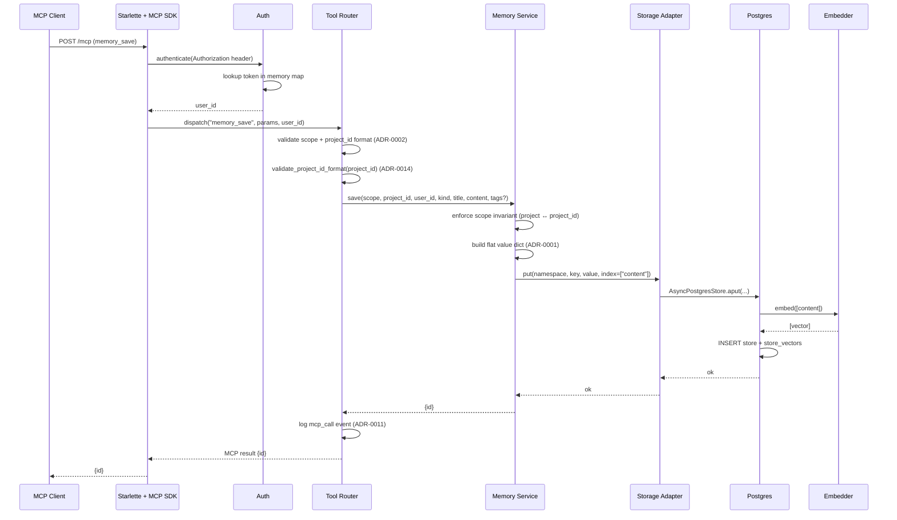
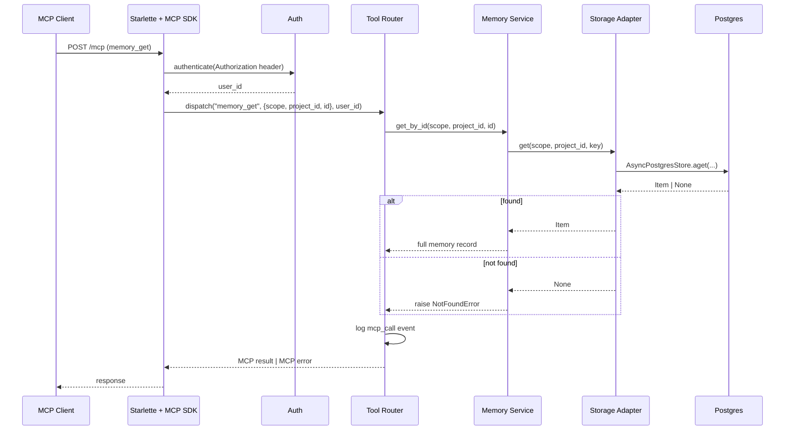
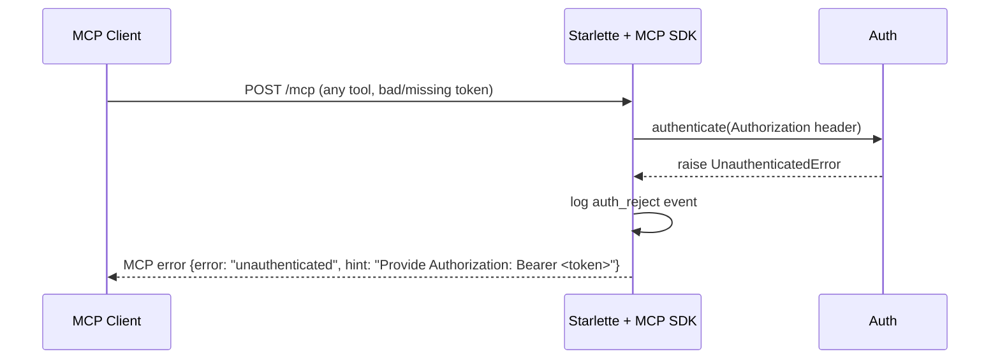
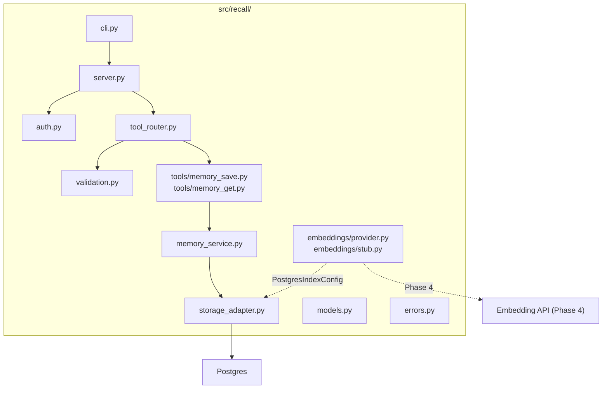

# LLD — Epic 1: One Memory, End-to-End

## Document Control

| Field | Value |
|-------|-------|
| Epic | E1 — One memory, end-to-end |
| Phase | 1 |
| Epic issue | #85 |
| Task issues | #86 (E1.1), #87 (E1.2), #88 (E1.3), #89 (E1.4), #90 (E1.5), #91 (E1.6) |
| HLD components | Auth, Project Registry (deferred — ADR-0014), Embedder, Memory Service, Tool Router, MCP Transport |
| ADRs | 0001 (flat schema), 0002 (namespace), 0004 (filters), 0006 (transport), 0007 (auth), 0008 (embeddings), 0011 (logging), 0014 (defer project registry, supersedes 0009) |
| Status | Revised |
| Date | 2026-04-12 |
| Last revised | 2026-08-06 — synced with ADR-0014 (deferred project registry), migrated to docs/design/v2/, added LLD anchors for coverage manifest |
| Revised | 2026-08-09 — synced with E1.1 implementation (issue #86): case-insensitive Bearer scheme, user_id string validation, RECALL_AUTH_FILE wiring deferred to E1.6 |
| Revised | 2026-08-09 — synced with E1.2 implementation (issue #87): `.fullmatch()` replaces `.match()` (trailing-newline gap); ValidationError(RecallError) shape deferred to E1.6 (#91); wave-table shared-files correction |
| Revised | 2026-08-09 — E1.3 (#88) implemented: sync `embed()` interface (see implementation note), `validate_dim` added |
| Revised | 2026-08-09 — E1.4 (#89) implemented: `validate_dim` call-site corrected to E1.6 (#91); `validate_dim` added to provider.py code block |

---

## Part A — Human-Reviewable

### Purpose

Deliver the smallest vertical slice that touches every component on the request
path: a bearer-authenticated agent calls `memory_save` to persist a
project-scoped memory (with embedding), then `memory_get` to retrieve it by
ID within its `(scope, project_id)` namespace,
over real Streamable HTTP, against real Postgres, with one structured log line
per call. After Phase 1 the architecture is real, not sketched.

<a id="LLD-e1-behavioural-save"></a>

### Behavioural Flow — memory_save (happy path)



<a id="LLD-e1-behavioural-get"></a>

### Behavioural Flow — memory_get (happy path)



<a id="LLD-e1-behavioural-auth-failure"></a>

### Behavioural Flow — Authentication failure



<a id="LLD-e1-structural"></a>

### Structural Overview



**Note:** `project_registry.py` from the original LLD is removed per ADR-0014. Project IDs are validated as well-formed strings only — no DB-backed registry, no cache, no `recall projects` CLI. The `validation.py` module contains `validate_project_id_format()`.

<a id="LLD-e1-invariants"></a>

### Invariants

| # | Invariant | Verification |
|---|-----------|-------------|
| I1 | Every request without a valid bearer token is rejected before any tool runs | Integration test: call memory_save without token → `unauthenticated` error |
| I2 | `scope=project` requires a well-formed `project_id` matching `^[a-zA-Z0-9_-]{1,128}$` and not the reserved name `global`; `scope=global` forbids `project_id` | Integration test: save with invalid project_id → `validation_error`; save global with project_id → `validation_error` |
| I3 | Namespace is always `(scope, project_id)` with sentinel `"_"` for global (ADR-0002) | Integration test: save global, inspect DB prefix = `global._` |
| I4 | Flat value schema — all filterable fields at root of `value` JSONB (ADR-0001) | Integration test: save memory, raw SQL SELECT value, assert `kind`, `scope`, `title` are top-level keys |
| I5 | Every memory_save generates an embedding; no memory exists without one | Integration test: save, then asearch with query returns the memory |
| I6 | memory_get returns the full record including user_id, created_at, updated_at | Integration test: save then get, assert all fields present |
| I7 | Every tool call emits exactly one structured `mcp_call` log event | Integration test: capture logs, assert one event per call with required fields |
| I8 | Any well-formed project_id is accepted on first write — no pre-registration required (ADR-0014) | Integration test: save to a never-before-seen project_id, assert success |
| I9 | `project_id` must match `^[a-zA-Z0-9_-]{1,128}$` and not be the reserved name `global` (ADR-0002, ADR-0014) | Unit test: invalid IDs rejected at the API boundary |

<a id="LLD-e1-acceptance-criteria"></a>

### Acceptance Criteria + BDD Specs

```python
@pytest.mark.integration
class TestMemorySaveEndToEnd:
    """Phase 1 exit criterion — save and retrieve over real MCP transport."""

    async def test_save_project_memory_round_trip(
        self, mcp_client, project_id
    ) -> None:
        """Given a valid bearer token and a well-formed project_id,
        when memory_save is called with scope=project,
        then an id is returned and memory_get retrieves the full record."""

    async def test_save_global_memory(self, mcp_client) -> None:
        """Given scope=global and no project_id,
        when memory_save is called,
        then the memory is stored under namespace ('global', '_')."""

    async def test_save_fails_without_auth(self, unauthenticated_client) -> None:
        """Given no bearer token,
        when memory_save is called,
        then {error: 'unauthenticated'} is returned."""

    async def test_save_fails_with_invalid_project_id(
        self, mcp_client
    ) -> None:
        """Given an invalid project_id (special chars, too long, or 'global'),
        when memory_save is called with scope=project,
        then {error: 'validation_error'} is returned."""

    async def test_save_validates_scope_invariant(self, mcp_client) -> None:
        """Given scope=global with a project_id,
        when memory_save is called,
        then {error: 'validation_error'} is returned."""

    async def test_structured_log_emitted(
        self, mcp_client, project_id, captured_logs
    ) -> None:
        """Given a successful memory_save,
        then exactly one mcp_call log event is emitted with
        request_id, user_id, project_id, tool='memory_save',
        latency_ms, result_status='ok'."""


@pytest.mark.integration
class TestMemoryGetEndToEnd:

    async def test_get_returns_full_record(
        self, mcp_client, saved_memory_id
    ) -> None:
        """Given a saved memory,
        when memory_get is called with its scope, project_id and id,
        then the full record is returned with all fields."""

    async def test_get_not_found(self, mcp_client) -> None:
        """Given a non-existent id in a known namespace,
        when memory_get is called,
        then {error: 'not_found'} is returned."""


class TestAuth:
    """Unit + integration tests for the Auth component."""

    def test_valid_token_resolves_user_id(self) -> None:
        """Given a token in the auth map, authenticate returns user_id."""

    def test_missing_token_raises(self) -> None:
        """Given no Authorization header, authenticate raises UnauthenticatedError."""

    def test_unknown_token_raises(self) -> None:
        """Given an unrecognised token, authenticate raises UnauthenticatedError."""

    def test_auth_file_loaded_from_env(self, tmp_path) -> None:
        """Given RECALL_AUTH_FILE pointing to a JSON file,
        the auth map is loaded at startup."""


class TestProjectIdValidation:
    """Unit tests for project_id format validation (ADR-0014)."""

    def test_valid_project_id_accepted(self) -> None:
        """Given a well-formed project_id matching ^[a-zA-Z0-9_-]{1,128}$, validation passes."""

    def test_global_reserved_name_rejected(self) -> None:
        """Given project_id='global' (case-insensitive), validation raises ValidationError."""

    def test_underscore_sentinel_rejected(self) -> None:
        """Given project_id='_', validation raises ValidationError (reserved sentinel)."""

    def test_special_chars_rejected(self) -> None:
        """Given project_id with dots, spaces, or other special characters, validation rejects."""

    def test_too_long_rejected(self) -> None:
        """Given project_id longer than 128 characters, validation rejects."""

    def test_empty_rejected(self) -> None:
        """Given empty project_id, validation rejects."""


class TestEmbedderInterface:
    """Unit tests for the EmbeddingsProvider interface and stub."""

    def test_stub_deterministic(self) -> None:
        """Same input → same vector."""

    def test_stub_correct_dim(self) -> None:
        """Vector length matches configured dim."""

    def test_dim_mismatch_fails_fast(self) -> None:
        """Given EMBEDDINGS_DIM != provider.dim, startup raises."""


class TestStorageAdapter:
    """Integration tests for the thin AsyncPostgresStore wrapper."""

    async def test_put_and_get_round_trip(self, store) -> None:
        """aput then aget returns the same value."""

    async def test_namespace_construction(self, store) -> None:
        """Project memory uses ('project', pid); global uses ('global', '_')."""

    async def test_scope_invariant_defence_in_depth(self, store) -> None:
        """Adapter rejects scope=project with project_id='_' before hitting DB."""


class TestMemoryService:
    """Integration tests for save + get orchestration."""

    async def test_save_delegates_to_storage_and_returns_id(self, service) -> None:
        """save() builds flat value, calls storage.put with index=["content"], returns an id."""

    async def test_save_builds_flat_value(self, service) -> None:
        """The stored value has kind, scope, title, content, user_id at root."""

    async def test_get_by_id_returns_full_record(self, service) -> None:
        """get_by_id returns all fields including timestamps."""

    async def test_get_by_id_not_found(self, service) -> None:
        """get_by_id raises NotFoundError for unknown id."""
```

---

## Part B — Agent-Implementable

<a id="LLD-e1-hld-coverage"></a>

### HLD Coverage Assessment

| HLD Component | Coverage in this LLD |
|---------------|---------------------|
| MCP Transport | MCP SDK Streamable HTTP wiring on the Starlette app from E0.6 |
| Auth | Fully covered — token-file loader, header parsing, contextvar |
| Tool Router | Fully covered — dispatch, validation, error formatting, logging |
| Project Registry | **Deferred (ADR-0014).** Project ID validated as well-formed string only; no DB-backed registry, no CLI |
| Memory Service | save and get_by_id covered; search/update/delete are E2/E3. Embedding is delegated to AsyncPostgresStore via index=["content"]. |
| Embedder | Interface + stub fully covered; plugged into PostgresIndexConfig at store creation. Real providers are E4. |
| Storage Adapter | put and get covered; search is E2 |
| CLI | No new CLI commands in Phase 1 (project CLI deferred per ADR-0014) |

### Layer: DB

No additional migrations needed for E1. The `store` and `store_vectors` tables from Phase 0 (E0.4) provide the storage substrate. The `projects` table from ADR-0009 is **not** created per ADR-0014.

### Layer: BE

<a id="LLD-e1-auth"></a>

#### `src/recall/auth.py`

```python
"""Bearer token authentication (ADR-0007)."""

from __future__ import annotations

import json
from dataclasses import dataclass

from recall.errors import UnauthenticatedError


@dataclass(frozen=True)
class AuthConfig:
    """Immutable token-to-user mapping loaded at startup."""
    token_map: dict[str, str]  # token → user_id


def load_auth_config(auth_file_path: str) -> AuthConfig:
    """Load token map from a JSON file.

    File format: {"<token>": {"user_id": "<id>"}, ...}

    Raises:
        FileNotFoundError: if the file does not exist.
        ValueError: if the file is not valid JSON or has wrong shape.
    """
    ...


def authenticate(auth_config: AuthConfig, authorization_header: str | None) -> str:
    """Extract and validate the bearer token from the Authorization header.

    Args:
        auth_config: The loaded token map.
        authorization_header: The raw Authorization header value, or None.

    Returns:
        The resolved user_id.

    Raises:
        UnauthenticatedError: if the header is missing, malformed, or the
            token is not in the map.
    """
    ...
```

**Key details:**
- The auth file is read once at startup. No hot-reload in v2 (restart to
  rotate tokens, per ADR-0007).
- `authenticate()` is a pure function — no I/O, no DB. Easy to unit test.
- `UnauthenticatedError` is defined in a shared `errors.py` module.

> **Implementation note (issue #86):** The `Bearer` auth-scheme token is
> matched case-insensitively (`parts[0].lower() != "bearer"`), per RFC 7235
> §2.1 — auth-scheme tokens are case-insensitive. Regression-tested
> (`test_bearer_scheme_is_case_insensitive`).
>
> **Implementation note (issue #86):** `load_auth_config` additionally
> validates that each entry's `user_id` is a string (`ValueError` otherwise) —
> a non-string `user_id` would silently corrupt the documented
> `authenticate() -> str` contract. Loader error messages never include token
> values (live credentials per ADR-0007).
>
> **Implementation note (issue #86):** Reading the file path from
> `RECALL_AUTH_FILE` is wired at server startup by E1.6 (issue #91); the
> loader itself takes an explicit path (see `TODO(#91)` in `load_auth_config`).

<a id="LLD-e1-project-id-validation"></a>

#### `src/recall/validation.py`

```python
"""Input validation helpers (ADR-0002, ADR-0014)."""

from __future__ import annotations

import re


PROJECT_ID_PATTERN = re.compile(r"^[a-zA-Z0-9_-]{1,128}$")
RESERVED_PROJECT_IDS: frozenset[str] = frozenset({"global", "_"})


def validate_project_id_format(project_id: str) -> None:
    """Check project_id matches ^[a-zA-Z0-9_-]{1,128}$ (ADR-0002).

    Also rejects reserved names: 'global', '_' (case-insensitive).

    This is a pure function — no I/O, no DB, no cache. Per ADR-0014,
    any well-formed, non-reserved project_id is accepted on first write.
    No pre-registration required.

    Raises:
        ValidationError: on format violation or reserved name.
    """
    if not project_id:
        raise ValidationError("project_id must not be empty")
    if project_id.lower() in RESERVED_PROJECT_IDS:
        raise ValidationError(
            f"'{project_id}' is a reserved name and cannot be used as a project_id"
        )
    if not PROJECT_ID_PATTERN.fullmatch(project_id):
        raise ValidationError(
            f"project_id '{project_id}' is invalid. "
            "Must match ^[a-zA-Z0-9_-]{1,128}$"
        )
```

> **Implementation note (issue #87):** The spec used `re.match(...)` with a
> `$` anchor. Python's `$` matches just before a trailing `\n`, so `.match()`
> silently accepted `'global\n'` and a 129-char ID ending in newline —
> bypassing the reserved-name guard and the `{1,128}` bound. The
> implementation uses `PROJECT_ID_PATTERN.fullmatch()`, which rejects both
> (regression test `test_trailing_newline_rejected`).

**Key details:**
- Pure function — no I/O, no DB. Trivially unit-testable.
- Called by the tool router before dispatching any project-scoped tool call.
- Per ADR-0014, there is **no** `projects` table, **no** registry cache, and
  **no** `recall projects` CLI subgroup. Any well-formed project_id is
  accepted on first write.
- The reserved-name check is case-insensitive to prevent ambiguity with the
  `global` scope keyword.

<a id="LLD-e1-embedder"></a>

#### `src/recall/embeddings/provider.py`

```python
"""Embeddings provider interface (ADR-0008)."""

from __future__ import annotations

from abc import ABC, abstractmethod


class EmbeddingsProvider(ABC):
    """Abstract base for embedding providers.

    All providers must declare their vector dimension and implement
    batch embedding.
    """

    @property
    @abstractmethod
    def dim(self) -> int:
        """The dimensionality of produced vectors."""
        ...

    @abstractmethod
    def embed(self, texts: list[str]) -> list[list[float]]:
        """Generate embeddings for a batch of texts.

        Args:
            texts: Non-empty list of strings to embed.

        Returns:
            One vector per input text, each of length self.dim.
        """
        ...


def validate_dim(provider: EmbeddingsProvider, configured_dim: int) -> None:
    """Fail-fast check that the configured dim matches the provider's dim.

    Called at startup wiring; a mismatch raises before any memory operation.

    Raises:
        ValueError: if ``configured_dim`` != ``provider.dim``.
    """
    if provider.dim != configured_dim:
        raise ValueError(
            f"EMBEDDINGS_DIM={configured_dim} does not match "
            f"{type(provider).__name__}.dim={provider.dim}"
        )
```

**Key details:**
- `dim` is a property, not a method — it's a fixed value per provider instance.
- The stub from E0.5 (`StubEmbeddingsProvider`) implements this interface.
  It moves from a plain class to inheriting `EmbeddingsProvider`.
- `validate_dim(provider, configured_dim)` is the fail-fast check for
  EMBEDDINGS_DIM vs the provider's dim; the startup call site lands at the
  composition root (E1.6, issue #91).

> **Implementation note (issue #89):** the LLD originally placed
> `validate_dim`'s call site in E1.4 ("store creation"), but E1.4's
> `StorageAdapter` wraps an *injected* `AsyncPostgresStore` — it has no
> store-creation site. Store creation lives at the composition root
> (`server.py` wiring, E1.6, issue #91), so the wiring is deferred there.

> **Implementation note (issue #88):** `embed()` was specified as `async` but
> was built **synchronous**. The only v1 consumer — LangGraph's
> `AsyncPostgresStore` — invokes the embed callable synchronously inside a
> thread-pool executor (`aput → run_in_executor → batch → embed_documents`);
> an async-only callable raises at runtime ("EmbeddingsLambda was initialized
> with an async function but no sync function"). A sync interface needs zero
> bridge code at every wiring point, ADR-0008's interface sketch is
> sync-shaped (`embed(texts) -> list[Vector]`, no await), and langgraph's
> executor already guarantees the event loop is not blocked — E4's HTTP
> provider can use a sync client inside that thread. The `Raises:
> EmbeddingError` clause was dropped: retry/error machinery is provider-level
> (E4), not interface-level; `EmbeddingError` itself remains designed in
> `errors.py` (§ errors module).

<a id="LLD-e1-storage-adapter"></a>

#### `src/recall/storage_adapter.py`

```python
"""Thin wrapper over AsyncPostgresStore (ADR-0001, ADR-0002)."""

from __future__ import annotations

from langgraph.store.postgres import AsyncPostgresStore


GLOBAL_SENTINEL = "_"


class StorageAdapter:
    """Namespace-aware wrapper over AsyncPostgresStore.

    Enforces the (scope, project_id) namespace shape (ADR-0002)
    and the scope invariant as defence-in-depth.
    """

    def __init__(self, store: AsyncPostgresStore) -> None:
        self._store = store

    async def put(
        self,
        scope: str,
        project_id: str,
        key: str,
        value: dict[str, Any],
        index: list[str] | Literal[False] | None = None,
    ) -> None:
        """Store a memory record.

        Args:
            scope: "project" or "global".
            project_id: The project ID, or GLOBAL_SENTINEL for global scope.
            key: The memory ID (UUID).
            value: Flat value dict (ADR-0001).
            index: Fields to embed, or False to skip embedding.

        Raises:
            ValidationError: if scope/project_id invariant is violated.
        """
        namespace = self._build_namespace(scope, project_id)
        await self._store.aput(namespace, key, value, index=index)

    async def get(
        self,
        scope: str,
        project_id: str,
        key: str,
    ) -> Item | None:
        """Retrieve a memory by namespace + key.

        Returns None if not found.
        """
        namespace = self._build_namespace(scope, project_id)
        return await self._store.aget(namespace, key)

    @staticmethod
    def _build_namespace(scope: str, project_id: str) -> tuple[str, str]:
        """Construct the 2-tuple namespace, enforcing the scope invariant.

        Raises:
            ValidationError: if scope=global and project_id != '_',
                or scope=project and project_id == '_'.
        """
        if scope == "global" and project_id != GLOBAL_SENTINEL:
            raise ValidationError(
                "Global scope requires project_id='_'"
            )
        if scope == "project" and project_id == GLOBAL_SENTINEL:
            raise ValidationError(
                "Project scope must not use the reserved sentinel '_'"
            )
        if scope not in ("global", "project"):
            raise ValidationError(f"Invalid scope: {scope}")
        return (scope, project_id)
```

**Key details:**
- The adapter is deliberately thin — it translates Recall's domain concepts
  (scope, project_id) into the store's namespace tuple and delegates.
- Defence-in-depth: validates the scope invariant in Python even though the
  DB CHECK constraint also enforces it. Belt and braces.
- `Item` is LangGraph's `Item` type from `langgraph.store.base`.

<a id="LLD-e1-memory-service"></a>

#### `src/recall/memory_service.py`

```python
"""Core memory lifecycle — save and get (Phase 1). Search/update/delete in later phases."""

from __future__ import annotations

import uuid
from datetime import datetime, timezone
from typing import Any


class MemoryService:
    """Orchestrates memory operations: build value, delegate to storage, resolve get-by-id."""

    def __init__(
        self,
        storage: StorageAdapter,
    ) -> None:
        self._storage = storage

    async def save(
        self,
        scope: str,
        project_id: str,
        user_id: str,
        kind: str,
        title: str,
        content: str,
        tags: list[str] | None = None,
        metadata: dict[str, Any] | None = None,
    ) -> str:
        """Save a new memory.

        1. Enforce scope invariant.
        2. Build the flat value dict (ADR-0001).
        3. Delegate to StorageAdapter — AsyncPostgresStore handles embedding
           internally via PostgresIndexConfig when index=["content"] is passed.
        4. Return the generated ID.

        Args:
            scope: "project" or "global".
            project_id: Project ID or "_" for global.
            user_id: Resolved from auth.
            kind: Free-form category (decision, convention, gotcha, etc.).
            title: Short title for the memory.
            content: Full content text.
            tags: Optional list of tag strings.
            metadata: Optional additional metadata dict.

        Returns:
            The generated memory ID (UUID string).

        Raises:
            ValidationError: scope invariant violation.
            EmbeddingError: embedding generation failed.
        """
        memory_id = str(uuid.uuid4())
        now = datetime.now(timezone.utc).isoformat()

        value: dict[str, Any] = {
            "scope": scope,
            "project_id": project_id,
            "user_id": user_id,
            "kind": kind,
            "title": title,
            "content": content,
            "tags": tags or [],
            "metadata": metadata or {},
            "created_at": now,
            "updated_at": now,
        }

        await self._storage.put(
            scope=scope,
            project_id=project_id,
            key=memory_id,
            value=value,
            index=["content"],  # embed the content field
        )

        return memory_id

    async def get_by_id(
        self, scope: str, project_id: str, memory_id: str
    ) -> dict[str, Any]:
        """Retrieve a memory by ID within its known namespace.

        The (scope, project_id) namespace is provided by the caller
        (ADR-0015) — search results carry it, and id-only resolution is
        intentionally unsupported. get is a direct namespaced read.

        Raises:
            NotFoundError: memory not found.
        """
        item = await self._storage.get(scope, project_id, memory_id)
        if item is None:
            raise NotFoundError(memory_id)
        return {"id": memory_id, **item.value}
```

**Design note — memory_get scope resolution (ADR-0015):**

The MCP tool `memory_get` takes `scope`, `project_id`, and `id` explicitly —
**no reverse index.** The original id-only contract (issue #90 AC2/AC3,
`("_index", "_")` index) was dropped per ADR-0015: there is no user-level
use case for id-only operations — search results already carry the scope —
and the index would turn save() into two non-atomic writes while widening
the storage namespace beyond `(scope, project_id)` (ADR-0002). `save()` is
a single write; `get_by_id` is a direct namespaced read.

<a id="LLD-e1-models"></a>

#### `src/recall/models.py`

```python
"""Domain models and the flat value schema (ADR-0001)."""

from __future__ import annotations

from pydantic import BaseModel, Field
from datetime import datetime


class MemoryRecord(BaseModel):
    """The flat value schema stored in AsyncPostgresStore.

    All fields are at the root of the JSONB `value` column.
    This model IS the stored shape — no hoist/unhoist (ADR-0001).
    """

    scope: str                          # "project" | "global"
    project_id: str                     # project ID or "_" for global
    user_id: str                        # who created/last updated
    kind: str                           # free-form: decision, convention, etc.
    title: str                          # short title
    content: str                        # full content
    tags: list[str] = Field(default_factory=list)
    metadata: dict[str, Any] = Field(default_factory=dict)
    created_at: str                     # ISO-8601 UTC
    updated_at: str                     # ISO-8601 UTC


class MemoryResponse(BaseModel):
    """Full memory record returned by memory_get."""

    id: str
    scope: str
    project_id: str
    user_id: str
    kind: str
    title: str
    content: str
    tags: list[str]
    metadata: dict[str, Any]
    created_at: str
    updated_at: str
```

<a id="LLD-e1-errors"></a>

#### `src/recall/errors.py`

```python
"""Shared error types and structured error formatting."""

from __future__ import annotations


class RecallError(Exception):
    """Base error for all Recall domain errors."""

    def __init__(self, error: str, hint: str) -> None:
        self.error = error
        self.hint = hint
        super().__init__(error)


class UnauthenticatedError(RecallError):
    def __init__(self) -> None:
        super().__init__(
            error="unauthenticated",
            hint="Provide Authorization: Bearer <token> header.",
        )


class ValidationError(RecallError):  # _(deferred → issue #91)_ — currently a bare Exception subclass
    def __init__(self, detail: str) -> None:
        super().__init__(
            error="validation_error",
            hint=detail,
        )


class NotFoundError(RecallError):
    def __init__(self, memory_id: str) -> None:
        super().__init__(
            error="not_found",
            hint=f"Memory '{memory_id}' does not exist. Verify the ID or search first.",
        )


class EmbeddingError(RecallError):
    def __init__(self, detail: str = "") -> None:
        super().__init__(
            error="embedding_failed",
            hint=f"Embedding generation failed. {detail}. Retry or check embedding provider.",
        )
```

<a id="LLD-e1-tool-router"></a>

#### `src/recall/tool_router.py`

```python
"""MCP tool registration, dispatch, validation, and error formatting."""

from __future__ import annotations

import time
import structlog

log = structlog.get_logger()


class ToolRouter:
    """Registers MCP tools and dispatches calls with cross-cutting concerns.

    Responsibilities:
    - Validate common parameters (scope, project_id)
    - Dispatch to MemoryService
    - Catch RecallError and format as structured MCP errors
    - Emit one mcp_call log event per call (ADR-0011)
    """

    def __init__(
        self,
        memory_service: MemoryService,
        auth_config: AuthConfig,
    ) -> None:
        self._memory_service = memory_service
        self._auth_config = auth_config

    async def handle_tool_call(
        self,
        tool_name: str,
        params: dict[str, Any],
        user_id: str,
    ) -> dict[str, Any]:
        """Dispatch a tool call with logging and error handling.

        Args:
            tool_name: The MCP tool name.
            params: The tool parameters.
            user_id: Resolved from auth.

        Returns:
            The tool result dict.

        Raises:
            Nothing — errors are caught and returned as structured dicts.
        """
        start = time.monotonic()
        try:
            result = await self._dispatch(tool_name, params, user_id)
            elapsed = (time.monotonic() - start) * 1000
            log.info(
                "mcp_call",
                tool=tool_name,
                user_id=user_id,
                project_id=params.get("project_id", ""),
                latency_ms=round(elapsed, 1),
                result_status="ok",
            )
            return result
        except RecallError as e:
            elapsed = (time.monotonic() - start) * 1000
            log.info(
                "mcp_call",
                tool=tool_name,
                user_id=user_id,
                project_id=params.get("project_id", ""),
                latency_ms=round(elapsed, 1),
                result_status=e.error,
            )
            return {"error": e.error, "hint": e.hint}

    async def _dispatch(
        self,
        tool_name: str,
        params: dict[str, Any],
        user_id: str,
    ) -> dict[str, Any]:
        """Route to the appropriate service method."""
        if tool_name == "memory_save":
            return await self._handle_memory_save(params, user_id)
        elif tool_name == "memory_get":
            return await self._handle_memory_get(params)
        else:
            raise ValidationError(f"Unknown tool: {tool_name}")

    async def _handle_memory_save(
        self, params: dict[str, Any], user_id: str
    ) -> dict[str, Any]:
        """Validate and delegate memory_save."""
        # Extract and validate params
        scope = params.get("scope", "")
        project_id = params.get("project_id", "_" if scope == "global" else "")
        kind = params.get("kind", "")
        title = params.get("title", "")
        content = params.get("content", "")

        # Validate required fields
        for field_name, value in [("scope", scope), ("kind", kind),
                                   ("title", title), ("content", content)]:
            if not value:
                raise ValidationError(f"Missing required field: {field_name}")

        # Validate project_id format for project-scoped calls (ADR-0014)
        if scope == "project":
            validate_project_id_format(project_id)

        memory_id = await self._memory_service.save(
            scope=scope,
            project_id=project_id if scope == "project" else "_",
            user_id=user_id,
            kind=kind,
            title=title,
            content=content,
            tags=params.get("tags"),
            metadata=params.get("metadata"),
        )
        return {"id": memory_id}

    async def _handle_memory_get(
        self, params: dict[str, Any]
    ) -> dict[str, Any]:
        """Validate and delegate memory_get."""
        scope = params.get("scope", "")
        project_id = params.get("project_id", "")
        memory_id = params.get("id", "")
        if not (scope and project_id and memory_id):
            raise ValidationError(
                "Missing required field: scope, project_id, id"
            )
        record = await self._memory_service.get_by_id(
            scope, project_id, memory_id
        )
        return record
```

**Key change from original LLD:** `ToolRouter.__init__` no longer takes `project_registry`. Per ADR-0014, project validation is a pure format check (`validate_project_id_format()`), not a DB-backed registry lookup.

<a id="LLD-e1-mcp-tool-declarations"></a>

#### MCP tool declarations

The MCP SDK tool declarations are registered on the MCP server instance.
Each tool has an agent-oriented description following Story 4.2.

```python
# Tool declarations (registered in server.py MCP setup)

MEMORY_SAVE_SCHEMA = {
    "name": "memory_save",
    "description": (
        "Store a new memory. Use this when the agent learns something worth "
        "remembering across sessions: a decision, convention, gotcha, or "
        "any other durable fact.\n\n"
        "Scope decision rule: if this fact would still be true and useful "
        "in a brand-new empty repo tomorrow, use scope='global'. Otherwise "
        "use scope='project'. When in doubt, prefer 'project'.\n\n"
        "Parameters:\n"
        "- scope (required): 'project' or 'global'\n"
        "- project_id (required if scope='project'): the project identifier\n"
        "- kind (required): category — e.g. 'decision', 'convention', "
        "'gotcha', 'component', 'episode', 'instruction'\n"
        "- title (required): short descriptive title\n"
        "- content (required): the full memory content\n"
        "- tags (optional): list of string tags\n"
        "- metadata (optional): additional key-value pairs"
    ),
    # JSON Schema for parameters omitted for brevity — follows the
    # tool reference table in requirements.
}

MEMORY_GET_SCHEMA = {
    "name": "memory_get",
    "description": (
        "Fetch the complete record of a memory by its ID. Use this after "
        "finding a memory via memory_search to read the full content "
        "(search returns snippets only).\n\n"
        "Parameters:\n"
        "- scope (required): \"project\" or \"global\" — the memory's scope\n"
        "- project_id (required): the project the memory belongs to (\"_\"\n"
        "  for global)\n"
        "- id (required): the memory ID returned by memory_save or memory_search"
    ),
}
```

<a id="LLD-e1-internal-decomposition"></a>

### Internal Decomposition

| Module | Responsibility | Boundary |
|--------|---------------|----------|
| `auth.py` | Token lookup, user_id resolution | Pure function, no I/O |
| `validation.py` | Project_id format check, reserved-name guard | Pure function, no I/O (ADR-0014) |
| `embeddings/provider.py` | EmbeddingsProvider ABC, `validate_dim` fail-fast check | Pure, no I/O |
| `embeddings/stub.py` | Deterministic test/dev provider | No I/O |
| `storage_adapter.py` | Namespace construction, scope invariant, delegate to store | Thin wrapper over AsyncPostgresStore |
| `memory_service.py` | Orchestrate save (build value → put) and get (direct namespaced read, ADR-0015) | Depends on storage adapter only |
| `tool_router.py` | Dispatch, validation, error formatting, logging | Depends on service + auth |
| `models.py` | Pydantic models for the flat value schema | Pure data |
| `errors.py` | Domain error types with {error, hint} shape | Pure data |

<a id="LLD-e1-tasks"></a>

### Tasks

| # | Task (E1.N) | Summary | Files touched | Depends on |
|---|-------------|---------|---------------|------------|
| 1 | E1.1 | Auth component — token-file loader, authenticate(), UnauthenticatedError | `src/recall/auth.py`, `src/recall/errors.py`, `tests/test_auth.py` | E0.1 |
| 2 | E1.2 | Project ID validation — format check, reserved-name guard (ADR-0014) | `src/recall/validation.py`, `src/recall/errors.py` (ValidationError), `tests/test_validation.py` | E0.1 |
| 3 | E1.3 | Embedder interface + stub upgrade | `src/recall/embeddings/provider.py`, `src/recall/embeddings/stub.py`, `tests/test_embeddings.py` | E0.5 |
| 4 | E1.4 | Storage adapter — put/get with namespace construction | `src/recall/storage_adapter.py`, `src/recall/models.py`, `tests/test_storage_adapter.py` | E1.3 |
| 5 | E1.5 | Memory Service — save + get_by_id (scope-explicit, ADR-0015) | `src/recall/memory_service.py`, `tests/test_memory_service.py` | E1.4 |
| 6 | E1.6 | Tool Router + MCP wiring for memory_save + memory_get | `src/recall/tool_router.py`, `src/recall/server.py`, `tests/test_tool_router.py`, `tests/test_e2e_phase1.py` | E1.1, E1.2, E1.5 |

<a id="LLD-e1-execution-waves"></a>

### Execution Waves (within E1)

| Wave | Tasks | Blocked by | Notes |
|------|-------|------------|-------|
| 1 | E1.1, E1.2, E1.3 | Phase 0 | Parallelisable; E1.1 and E1.2 share `src/recall/errors.py` — second landing PR must rebase and merge both error classes |

> **Implementation note (issue #87):** The original "no shared files" claim
> was wrong — E1.1 (issue #86) writes `RecallError`/`UnauthenticatedError`
> and E1.2 (issue #87) writes `ValidationError` in the same module. Still
> parallelisable, but the second PR to land rebases `errors.py` and keeps
> both sides' classes.
| 2 | E1.4 | E1.3 | Storage adapter needs embedder interface |
| 3 | E1.5 | E1.4 | Memory service needs storage adapter |
| 4 | E1.6 | E1.1, E1.2, E1.5 | Tool router integrates everything |
